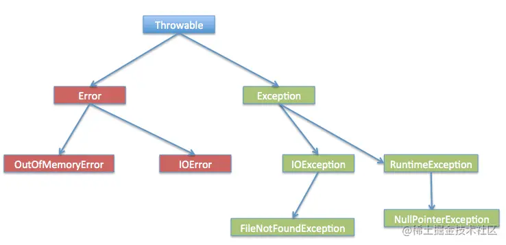

## 1.包装类

### 1.1基本类型包装类（记忆）

- 基本类型包装类的作用

  ​	将基本数据类型封装成对象的好处在于可以在对象中定义更多的功能方法操作该数据

  ​	常用的操作之一：用于基本数据类型与字符串之间的转换

- 基本类型对应的包装类

  | 基本数据类型 | 包装类    |
  | ------------ | --------- |
  | byte         | Byte      |
  | short        | Short     |
  | int          | Integer   |
  | long         | Long      |
  | float        | Float     |
  | double       | Double    |
  | char         | Character |
  | boolean      | Boolean   |

### 1.2Integer类（应用）

- Integer类概述

  ​	包装一个对象中的原始类型 int 的值

- Integer类构造方法

  | 方法名                                  | 说明                                     |
  | --------------------------------------- | ---------------------------------------- |
  | public Integer(int   value)             | 根据 int 值创建 Integer 对象(过时)       |
  | public Integer(String s)                | 根据 String 值创建 Integer 对象(过时)    |
  | public static Integer valueOf(int i)    | 返回表示指定的 int 值的 Integer   实例   |
  | public static Integer valueOf(String s) | 返回一个保存指定值的 Integer 对象 String |

- 示例代码

  ```java
  public class IntegerDemo {
      public static void main(String[] args) {
          //public Integer(int value)：根据 int 值创建 Integer 对象(过时)
          Integer i1 = new Integer(100);
          System.out.println(i1);
  
          //public Integer(String s)：根据 String 值创建 Integer 对象(过时)
          Integer i2 = new Integer("100");
  //        Integer i2 = new Integer("abc"); //NumberFormatException
          System.out.println(i2);
          System.out.println("--------");
  
          //public static Integer valueOf(int i)：返回表示指定的 int 值的 Integer 实例
          Integer i3 = Integer.valueOf(100);
          System.out.println(i3);
  
          //public static Integer valueOf(String s)：返回一个保存指定值的Integer对象 String
          Integer i4 = Integer.valueOf("100");
          System.out.println(i4);
      }
  }
  ```

### 1.3int和String类型的相互转换（记忆）

- int转换为String

  - 转换方式

    - 方式一：直接在数字后加一个空字符串
    - 方式二：通过String类静态方法valueOf()

  - 示例代码

    ```java
    public class IntegerDemo {
        public static void main(String[] args) {
            //int --- String
            int number = 100;
            //方式1
            String s1 = number + "";
            System.out.println(s1);
            //方式2
            //public static String valueOf(int i)
            String s2 = String.valueOf(number);
            System.out.println(s2);
            System.out.println("--------");
        }
    }
    ```

- String转换为int

  - 转换方式

    - 方式一：先将字符串数字转成Integer，再调用valueOf()方法
    - 方式二：通过Integer静态方法parseInt()进行转换

  - 示例代码

    ```java
    public class IntegerDemo {
        public static void main(String[] args) {
            //String --- int
            String s = "100";
            //方式1：String --- Integer --- int
            Integer i = Integer.valueOf(s);
            //public int intValue()
            int x = i.intValue();
            System.out.println(x);
            //方式2
            //public static int parseInt(String s)
            int y = Integer.parseInt(s);
            System.out.println(y);
        }
    }
    ```

### 1.4字符串数据排序案例（应用）

- 案例需求

  ​	有一个字符串：“91 27 46 38 50”，请写程序实现最终输出结果是：“27 38 46 50 91”

- 代码实现

  ```java
  public class IntegerTest {
      public static void main(String[] args) {
          //定义一个字符串
          String s = "91 27 46 38 50";
  
          //把字符串中的数字数据存储到一个int类型的数组中
          String[] strArray = s.split(" ");
  //        for(int i=0; i<strArray.length; i++) {
  //            System.out.println(strArray[i]);
  //        }
  
          //定义一个int数组，把 String[] 数组中的每一个元素存储到 int 数组中
          int[] arr = new int[strArray.length];
          for(int i=0; i<arr.length; i++) {
              arr[i] = Integer.parseInt(strArray[i]);
          }
  
          //对 int 数组进行排序
          Arrays.sort(arr);
  
          //把排序后的int数组中的元素进行拼接得到一个字符串，这里拼接采用StringBuilder来实现
          StringBuilder sb = new StringBuilder();
          for(int i=0; i<arr.length; i++) {
              if(i == arr.length - 1) {
                  sb.append(arr[i]);
              } else {
                  sb.append(arr[i]).append(" ");
              }
          }
          String result = sb.toString();
  
          //输出结果
          System.out.println(result);
      }
  }
  ```

### 1.5自动拆箱和自动装箱（理解）

- 自动装箱

  ​	把基本数据类型转换为对应的包装类类型

- 自动拆箱

  ​	把包装类类型转换为对应的基本数据类型

- 示例代码

  ```java
  Integer i = 100;  // 自动装箱
  i += 200;         // i = i + 200;  i + 200 自动拆箱；i = i + 200; 是自动装箱
  ```

## 2.时间日期类

### 2.1Date类（应用）

- Date类概述

  ​	Date 代表了一个特定的时间，精确到毫秒

- Date类构造方法

  | 方法名                 | 说明                                                         |
  | ---------------------- | ------------------------------------------------------------ |
  | public Date()          | 分配一个 Date对象，并初始化，以便它代表它被分配的时间，精确到毫秒 |
  | public Date(long date) | 分配一个 Date对象，并将其初始化为表示从标准基准时间起指定的毫秒数 |

- 示例代码

  ```java
  public class DateDemo01 {
      public static void main(String[] args) {
          //public Date()：分配一个 Date对象，并初始化，以便它代表它被分配的时间，精确到毫秒
          Date d1 = new Date();
          System.out.println(d1);
  
          //public Date(long date)：分配一个 Date对象，并将其初始化为表示从标准基准时间起指定的毫秒数
          long date = 1000*60*60;
          Date d2 = new Date(date);
          System.out.println(d2);
      }
  }
  ```

### 2.2Date类常用方法（应用）

- 常用方法

  | 方法名                         | 说明                                                  |
  | ------------------------------ | ----------------------------------------------------- |
  | public long getTime()          | 获取的是日期对象从1970年1月1日 00:00:00到现在的毫秒值 |
  | public void setTime(long time) | 设置时间，给的是毫秒值                                |

- 示例代码

  ```java
  public class DateDemo02 {
      public static void main(String[] args) {
          //创建日期对象
          Date d = new Date();
  
          //public long getTime():获取的是日期对象从1970年1月1日 00:00:00到现在的毫秒值
  //        System.out.println(d.getTime());
  //        System.out.println(d.getTime() * 1.0 / 1000 / 60 / 60 / 24 / 365 + "年");
  
          //public void setTime(long time):设置时间，给的是毫秒值
  //        long time = 1000*60*60;
          long time = System.currentTimeMillis();
          d.setTime(time);
  
          System.out.println(d);
      }
  }
  ```

### 2.3SimpleDateFormat类（应用）

- SimpleDateFormat类概述

  ​	SimpleDateFormat是一个具体的类，用于以区域设置敏感的方式格式化和解析日期。

  ​	我们重点学习日期格式化和解析

- SimpleDateFormat类构造方法

  | 方法名                                  | 说明                                                   |
  | --------------------------------------- | ------------------------------------------------------ |
  | public   SimpleDateFormat()             | 构造一个SimpleDateFormat，使用默认模式和日期格式       |
  | public SimpleDateFormat(String pattern) | 构造一个SimpleDateFormat使用给定的模式和默认的日期格式 |

- SimpleDateFormat类的常用方法

  - 格式化(从Date到String)
    - public final String format(Date date)：将日期格式化成日期/时间字符串
  - 解析(从String到Date)
    - public Date parse(String source)：从给定字符串的开始解析文本以生成日期

- 示例代码

  ```java
  public class SimpleDateFormatDemo {
      public static void main(String[] args) throws ParseException {
          //格式化：从 Date 到 String
          Date d = new Date();
  //        SimpleDateFormat sdf = new SimpleDateFormat();
          SimpleDateFormat sdf = new SimpleDateFormat("yyyy年MM月dd日 HH:mm:ss");
          String s = sdf.format(d);
          System.out.println(s);
          System.out.println("--------");
  
          //从 String 到 Date
          String ss = "2048-08-09 11:11:11";
          //ParseException
          SimpleDateFormat sdf2 = new SimpleDateFormat("yyyy-MM-dd HH:mm:ss");
          Date dd = sdf2.parse(ss);
          System.out.println(dd);
      }
  }
  ```

### 2.4日期工具类案例（应用）

- 案例需求

  ​	定义一个日期工具类(DateUtils)，包含两个方法：把日期转换为指定格式的字符串；把字符串解析为指定格式的日期，然后定义一个测试类(DateDemo)，测试日期工具类的方法

- 代码实现

  - 工具类

  ```java
  public class DateUtils {
      private DateUtils() {}
  
      /*
          把日期转为指定格式的字符串
          返回值类型：String
          参数：Date date, String format
       */
      public static String dateToString(Date date, String format) {
          SimpleDateFormat sdf = new SimpleDateFormat(format);
          String s = sdf.format(date);
          return s;
      }
  
  
      /*
          把字符串解析为指定格式的日期
          返回值类型：Date
          参数：String s, String format
       */
      public static Date stringToDate(String s, String format) throws ParseException {
          SimpleDateFormat sdf = new SimpleDateFormat(format);
          Date d = sdf.parse(s);
          return d;
      }
  
  }
  ```

  - 测试类

  ```java
  public class DateDemo {
      public static void main(String[] args) throws ParseException {
          //创建日期对象
          Date d = new Date();
  
          String s1 = DateUtils.dateToString(d, "yyyy年MM月dd日 HH:mm:ss");
          System.out.println(s1);
  
          String s2 = DateUtils.dateToString(d, "yyyy年MM月dd日");
          System.out.println(s2);
  
          String s3 = DateUtils.dateToString(d, "HH:mm:ss");
          System.out.println(s3);
          System.out.println("--------");
  
          String s = "2048-08-09 12:12:12";
          Date dd = DateUtils.stringToDate(s, "yyyy-MM-dd HH:mm:ss");
          System.out.println(dd);
      }
  }
  ```

### 2.5Calendar类（应用）

- Calendar类概述

  ​	Calendar 为特定瞬间与一组日历字段之间的转换提供了一些方法，并为操作日历字段提供了一些方法

  ​	Calendar 提供了一个类方法 getInstance 用于获取这种类型的一般有用的对象。

  ​	该方法返回一个Calendar 对象。

  ​	其日历字段已使用当前日期和时间初始化：Calendar rightNow = Calendar.getInstance();

- Calendar类常用方法

  | 方法名                                             | 说明                                                   |
  | -------------------------------------------------- | ------------------------------------------------------ |
  | public int   get(int field)                        | 返回给定日历字段的值                                   |
  | public abstract void add(int   field, int amount)  | 根据日历的规则，将指定的时间量添加或减去给定的日历字段 |
  | public final void set(int year,int month,int date) | 设置当前日历的年月日                                   |

- 示例代码

  ```java
  public class CalendarDemo {
      public static void main(String[] args) {
          //获取日历类对象
          Calendar c = Calendar.getInstance();
  
          //public int get(int field):返回给定日历字段的值
          int year = c.get(Calendar.YEAR);
          int month = c.get(Calendar.MONTH) + 1;
          int date = c.get(Calendar.DATE);
          System.out.println(year + "年" + month + "月" + date + "日");
  
          //public abstract void add(int field, int amount):根据日历的规则，将指定的时间量添加或减去给定的日历字段
          //需求1:3年前的今天
  //        c.add(Calendar.YEAR,-3);
  //        year = c.get(Calendar.YEAR);
  //        month = c.get(Calendar.MONTH) + 1;
  //        date = c.get(Calendar.DATE);
  //        System.out.println(year + "年" + month + "月" + date + "日");
  
          //需求2:10年后的10天前
  //        c.add(Calendar.YEAR,10);
  //        c.add(Calendar.DATE,-10);
  //        year = c.get(Calendar.YEAR);
  //        month = c.get(Calendar.MONTH) + 1;
  //        date = c.get(Calendar.DATE);
  //        System.out.println(year + "年" + month + "月" + date + "日");
  
          //public final void set(int year,int month,int date):设置当前日历的年月日
          c.set(2050,10,10);
          year = c.get(Calendar.YEAR);
          month = c.get(Calendar.MONTH) + 1;
          date = c.get(Calendar.DATE);
          System.out.println(year + "年" + month + "月" + date + "日");
  
      }
  }
  ```

### 2.6二月天案例（应用）

- 案例需求

  ​	获取任意一年的二月有多少天

- 代码实现

  ```java
  public class CalendarTest {
      public static void main(String[] args) {
          //键盘录入任意的年份
          Scanner sc = new Scanner(System.in);
          System.out.println("请输入年：");
          int year = sc.nextInt();
  
          //设置日历对象的年、月、日
          Calendar c = Calendar.getInstance();
          c.set(year, 2, 1);
  
          //3月1日往前推一天，就是2月的最后一天
          c.add(Calendar.DATE, -1);
  
          //获取这一天输出即可
          int date = c.get(Calendar.DATE);
          System.out.println(year + "年的2月份有" + date + "天");
      }
  }
  ```

## 3.异常

### 3.1异常（记忆）

- 异常的概述

  ​	异常就是程序出现了不正常的情况

- 异常的体系结构

  ​	

### 3.2JVM默认处理异常的方式（理解）

- 如果程序出现了问题，我们没有做任何处理，最终JVM 会做默认的处理，处理方式有如下两个步骤：

- 把异常的名称，错误原因及异常出现的位置等信息输出在了控制台
- 程序停止执行


### 3.3JAVA异常处理

- **异常是程序中的一些错误，但并不是所有的错误都是异常**，并且错误有时候是可以避免的。比如说，你的代码少了一个分号，那么运行出来结果是提示是错误 java.lang.Error；如果你用System.out.println(11/0)，那么你是因为你用0做了除数，会抛出 java.lang.ArithmeticException 的异常。

  异常发生的原因有很多，通常包含以下几大类：
  
  - 用户输入了非法数据。
  - 要打开的文件不存在。
  - 网络通信时连接中断，或者JVM内存溢出。
  
  这些异常有的是因为用户错误引起，有的是程序错误引起的，还有其它一些是因为物理错误引起的。
  
  要理解Java异常处理是如何工作的，你需要掌握以下三种类型的异常：
  
  - **检查性异常**：最具代表的检查性异常是用户错误或问题引起的异常，这是程序员无法预见的。例如要打开一个不存在文件时，一个异常就发生了，这些异常在编译时不能被简单地忽略。
  - **运行时异常**：运行时异常是可能被程序员避免的异常。与检查性异常相反，运行时异常可以在编译时被忽略。
  - **错误**：错误不是异常，而是脱离程序员控制的问题。错误在代码中通常被忽略。例如，当栈溢出时，一个错误就发生了，它们在编译也检查不到的。
  
  #### Exception 类的层次
  
  **所有的异常类是从 java.lang.Exception 类继承的子类。异常类有两个主要的子类：IOException 类和 RuntimeException 类**。Exception 类是 Throwable 类的子类。除了Exception类外，Throwable还有一个子类Error 。Error 用来指示运行时环境发生的错误。**Java 程序通常不捕获错误**。错误一般发生在严重故障时，它们在Java程序处理的范畴之外。例如，JVM 内存溢出。一般地，程序不会从错误中恢复。
  
  
  
  在 Java 内置类中(接下来会说明)，有大部分常用检查性和非检查性异常。
  
  #### Java 内置异常类
  
  **Java 语言定义了一些异常类在 java.lang 标准包中**。标准运行时异常类的子类是最常见的异常类。由于 java.lang 包是默认加载到所有的 Java 程序的，所以大部分从运行时异常类继承而来的异常都可以直接使用。
  
  Java 根据各个类库也定义了一些其他的异常，下面的表中列出了 Java 的**非检查性异常**：
  
  - **ArithmeticException** —— 当出现异常的运算条件时，抛出此异常。例如，一个整数"除以零"时，抛出此类的一个实例。
  - **ArrayIndexOutOfBoundsException** —— 用非法索引访问数组时抛出的异常。如果索引为负或大于等于数组大小，则该索引为非法索引。
  - **ArrayStoreException** —— 试图将错误类型的对象存储到一个对象数组时抛出的异常。
  - **ClassCastException** —— 当试图将对象强制转换为不是实例的子类时，抛出该异常。
  - **IllegalArgumentException** —— 抛出的异常表明向方法传递了一个不合法或不正确的参数。
  - **IllegalMonitorStateException** —— 抛出的异常表明某一线程已经试图等待对象的监视器，或者试图通知其他正在等待对象的监视器而本身没有指定监视器的线程。
  - **IllegalStateException** —— 在非法或不适当的时间调用方法时产生的信号。换句话说，即 Java 环境或 Java 应用程序没有处于请求操作所要求的适当状态下。
  - **IllegalThreadStateException** —— 线程没有处于请求操作所要求的适当状态时抛出的异常。
  - **IndexOutOfBoundsException** —— 指示某排序索引（例如对数组、字符串或向量的排序）超出范围时抛出。
  - **NegativeArraySizeException** —— 如果应用程序试图创建大小为负的数组，则抛出该异常。
  - **NullPointerException** —— 当应用程序试图在需要对象的地方使用 null 时，抛出该异常。
  - **NumberFormatException** —— 当应用程序试图将字符串转换成一种数值类型，但该字符串不能转换为适当格式时，抛出该异常。
  - **SecurityException** —— 由安全管理器抛出的异常，指示存在安全侵犯。
  - **StringIndexOutOfBoundsException** —— 此异常由 String 方法抛出，指示索引或者为负，或者超出字符串的大小。
  - **UnsupportedOperationException** —— 当不支持请求的操作时，抛出该异常。
  
  下面的表中列出了 Java 定义在 java.lang 包中的**检查性异常类**。
  
  - **ClassNotFoundException** —— 应用程序试图加载类时，找不到相应的类，抛出该异常。
  - **CloneNotSupportedException** —— 当调用 Object 类中的 clone 方法克隆对象，但该对象的类无法实现 Cloneable 接口时，抛出该异常。
  - **IllegalAccessException** —— 拒绝访问一个类的时候，抛出该异常。
  - **InstantiationException** —— 当试图使用 Class 类中的 newInstance 方法创建一个类的实例，而指定的类对象因为是一个接口或是一个抽象类而无法实例化时，抛出该异常。
  - **InterruptedException** —— 一个线程被另一个线程中断，抛出该异常。
  - **NoSuchFieldException** —— 请求的变量不存在。
  - **NoSuchMethodException** —— 请求的方法不存在。
  
  #### 异常方法
  
  下面的列表是 Throwable 类的主要方法：
  
  | 序号 | 方法及说明                                                   |
  | ---- | ------------------------------------------------------------ |
  | 1    | public String getMessage()，返回关于发生的异常的详细信息。这个消息在Throwable 类的构造函数中初始化了 |
  | 2    | public Throwable getCause()，返回一个 Throwable 对象代表异常原因 |
  | 3    | public String toString()，返回此 Throwable 的简短描述        |
  | 4    | public void printStackTrace()，将此 Throwable 及其回溯打印到标准错误流 |
  | 5    | public StackTraceElement [] getStackTrace()，返回一个包含堆栈层次的数组。下标为0的元素代表栈顶，最后一个元素代表方法调用堆栈的栈底 |
  | 6    | public Throwable fillInStackTrace()，用当前的调用栈层次填充Throwable 对象栈层次，添加到栈层次任何先前信息中 |
  
  #### 捕获异常
  
  **使用 try 和 catch 关键字可以捕获异常。try/catch 代码块放在异常可能发生的地方**。try/catch代码块中的代码称为保护代码，使用 try/catch 的语法如下：
  
  ```csharp
  try
  {
     // 程序代码
  }catch(ExceptionName e1)
  {
     //Catch 块
  }
  复制代码
  ```
  
  **Catch 语句包含要捕获异常类型的声明。当保护代码块中发生一个异常时，try 后面的 catch 块就会被检查**。如果发生的异常包含在 catch 块中，异常会被传递到该 catch 块，这和传递一个参数到方法是一样。try/catch 语句使用实例如下：
  
  ```csharp
  // 文件名 : ExcepTest.java
  import java.io.*;
  public class ExcepTest{
   
     public static void main(String args[]){
        try{
           int a[] = new int[2];
           System.out.println("Access element three :" + a[3]);
        }catch(ArrayIndexOutOfBoundsException e){
           System.out.println("Exception thrown  :" + e);
        }
        System.out.println("Out of the block");
     }
  }
  // 以上代码编译运行输出结果如下：
  // Exception thrown  :java.lang.ArrayIndexOutOfBoundsException: 3
  // Out of the block
  复制代码
  ```
  
  **多重捕获块**：一个 try 代码块后面跟随多个 catch 代码块的情况就叫多重捕获。多重捕获块的语法如下所示：
  
  ```scss
  try{
     // 程序代码
  }catch(异常类型1 异常的变量名1){
    // 程序代码
  }catch(异常类型2 异常的变量名2){
    // 程序代码
  }catch(异常类型3 异常的变量名3){
    // 程序代码
  }
  复制代码
  ```
  
  上面的代码段包含了 3 个 catch块。可以在 try 语句后面添加任意数量的 catch 块。如果保护代码中发生异常，异常被抛给第一个 catch 块。如果抛出异常的数据类型与 ExceptionType1 匹配，它在这里就会被捕获。如果不匹配，它会被传递给第二个 catch 块。如此，直到异常被捕获或者通过所有的 catch 块。实例展示了怎么使用多重 try/catch ：
  
  ```scss
  try {
      file = new FileInputStream(fileName);
      x = (byte) file.read();
  } catch(FileNotFoundException f) { // Not valid!
      f.printStackTrace();
      return -1;
  } catch(IOException i) {
      i.printStackTrace();
      return -1;
  }
  复制代码
  ```
  
  #### throws/throw 关键字
  
  在Java中， throw 和 throws 关键字是用于处理异常的。**throw 关键字用于在代码中抛出异常，而 throws 关键字用于在方法声明中指定可能会抛出的异常类型**。
  
  **throw 关键字：用于在当前方法中抛出一个异常**。通常情况下，当代码执行到某个条件下无法继续正常执行时，可以使用 throw 关键字抛出异常，以告知调用者当前代码的执行状态。例如，下面的代码中，在方法中判断 num 是否小于 0，如果是，则抛出一个 IllegalArgumentException 异常：
  
  ```arduino
  public void checkNumber(int num) {
    if (num < 0) {
      throw new IllegalArgumentException("Number must be positive");
    }
  }
  复制代码
  ```
  
  **throws 关键字：用于在方法声明中指定该方法可能抛出的异常**。当方法内部抛出指定类型的异常时，该异常会被传递给调用该方法的代码，并在该代码中处理异常。例如，下面的代码中，当 readFile 方法内部发生 IOException 异常时，会将该异常传递给调用该方法的代码。在调用该方法的代码中，必须捕获或声明处理 IOException 异常：
  
  ```arduino
  public void readFile(String filePath) throws IOException {
    BufferedReader reader = new BufferedReader(new FileReader(filePath));
    String line = reader.readLine();
    while (line != null) {
      System.out.println(line);
      line = reader.readLine();
    }
    reader.close();
  }
  复制代码
  ```
  
  **一个方法可以声明抛出多个异常，多个异常之间用逗号隔开**。例如，下面的方法声明抛出 RemoteException 和 InsufficientFundsException：
  
  ```java
  import java.io.*;
  public class className
  {
     public void withdraw(double amount) throws RemoteException,
                                InsufficientFundsException
     {
         // Method implementation
     }
     //Remainder of class definition
  }
  复制代码
  ```
  
  #### finally关键字
  
  **finally 关键字用来创建在 try 代码块后面执行的代码块。无论是否发生异常，finally 代码块中的代码总会被执行。在 finally 代码块中，可以运行清理类型等收尾善后性质的语句**。finally 代码块出现在 catch 代码块最后，语法如下：
  
  ```csharp
  try{
    // 程序代码
  }catch(异常类型1 异常的变量名1){
    // 程序代码
  }catch(异常类型2 异常的变量名2){
    // 程序代码
  }finally{
    // 程序代码
  }
  复制代码
  ```
  
  finally 关键字使用实例：
  
  ```csharp
  public class ExcepTest{
    public static void main(String args[]){
      int a[] = new int[2];
      try{
         System.out.println("Access element three :" + a[3]);
      }catch(ArrayIndexOutOfBoundsException e){
         System.out.println("Exception thrown  :" + e);
      }
      finally{
         a[0] = 6;
         System.out.println("First element value: " +a[0]);
         System.out.println("The finally statement is executed");
      }
    }
  }
  // 实例编译运行结果如下：
  // Exception thrown  :java.lang.ArrayIndexOutOfBoundsException: 3
  // First element value: 6
  // The finally statement is executed
  复制代码
  ```
  
  **捕获异常注意下面事项**：
  
  - catch 不能独立于 try 存在。
  - 在 try/catch 后面添加 finally 块并非强制性要求的。
  - try 代码后不能既没 catch 块也没 finally 块。
  - try, catch, finally 块之间不能添加任何代码。
  
  #### try-with-resources
  
  JDK7 之后，Java 新增的 **try-with-resource 语法糖来打开资源，并且可以在语句执行完毕后确保每个资源都被自动关闭(注意：try-with-resources 语句关闭所有实现 AutoCloseable 接口的资源)**。JDK7 之前所有被打开的系统资源，比如流、文件或者 Socket 连接等，都需要被开发者手动关闭，否则将会造成资源泄露。try-with-resources语法如下：
  
  ```csharp
  // 语法中 try 用于声明和实例化资源，catch 用于处理关闭资源时可能引发的所有异常
  try (resource declaration) {
    // 使用的资源
  } catch (ExceptionType e1) {
    // 异常块
  }
  复制代码
  ```
  
  try-with-resources 语句使用实例：
  
  ```typescript
  import java.io.*;
  
  public class RunoobTest {
  
      public static void main(String[] args) {
          String line;
          try(BufferedReader br = new BufferedReader(new FileReader("test.txt"))) {
              while ((line = br.readLine()) != null) {
                  System.out.println("Line =>"+line);
              }
          } catch (IOException e) {
              System.out.println("IOException in try block =>" + e.getMessage());
          }
      }
  }
  // 实例输出结果为：
  // IOException in try block =>test.txt (No such file or directory)
  复制代码
  ```
  
  以上实例中，我们实例一个 BufferedReader 对象从 test.txt 文件中读取数据。 在 try-with-resources 语句中声明和实例化 BufferedReader 对象，执行完毕后实例资源，不需要考虑 try 语句是正常执行还是抛出异常。如果发生异常，可以使用 catch 来处理异常。
  
  再看下不使用 try-with-resources 而改成 finally 来关闭资源，整体代码量多了很多，而且更复杂繁琐了：
  
  ```csharp
  import java.io.*;
  
  class RunoobTest {
      public static void main(String[] args) {
          BufferedReader br = null;
          String line;
  
          try {
              System.out.println("Entering try block");
              br = new BufferedReader(new FileReader("test.txt"));
              while ((line = br.readLine()) != null) {
                  System.out.println("Line =>"+line);
              }
          } catch (IOException e) {
              System.out.println("IOException in try block =>" + e.getMessage());
          } finally {
              System.out.println("Entering finally block");
              try {
                  if (br != null) {
                      br.close();
                  }
              } catch (IOException e) {
                  System.out.println("IOException in finally block =>"+e.getMessage());
              }
          }
      }
  }
  // 实例输出结果为：
  // Entering try block
  // IOException in try block =>test.txt (No such file or directory)
  // Entering finally block
  复制代码
  ```
  
  **try-with-resources 处理多个资源**：try-with-resources 语句中可以声明多个资源，方法是使用分号 ; 分隔各个资源：
  
  ```java
  import java.io.*;
  import java.util.*;
  class RunoobTest {
      public static void main(String[] args) throws IOException{
          try (Scanner scanner = new Scanner(new File("testRead.txt")); 
              PrintWriter writer = new PrintWriter(new File("testWrite.txt"))) {
              while (scanner.hasNext()) {
                  writer.print(scanner.nextLine());
              }
          }
      }
  }
  复制代码
  ```
  
  以上实例使用 Scanner 对象从 testRead.txt 文件中读取一行并将其写入新的 testWrite.txt 文件中。**多个声明资源时，try-with-resources 语句以相反的顺序关闭这些资源**。 在本例中，PrintWriter 对象先关闭，然后 Scanner 对象关闭。
  
  #### 声明自定义异常
  
  在 Java 中你可以自定义异常。编写自己的异常类时需要记住下面的几点：
  
  - 所有异常都必须是 Throwable 的子类。
  - 如果希望写一个检查性异常类，则需要继承 Exception 类。
  - 如果你想写一个运行时异常类，那么需要继承 RuntimeException 类。
  
  可以像下面这样定义自己的异常类：
  
  ```scala
  class MyException extends Exception{
  }
  复制代码
  ```
  
  **只继承Exception 类来创建的异常类是检查性异常类**。一个异常类和其它任何类一样，包含有变量和方法。下面的 InsufficientFundsException 类是用户定义的异常类，它继承自 Exception 。
  
  自定义异常实例：\color{red}{自定义异常实例 ：}自定义异常实例：
  
  ```csharp
  public class BankDemo {
      public static void main(String[] args) {
          // 创建账户类对象
          CheckingAccount c = new CheckingAccount(101);
          System.out.println("Depositing $500...");
          // 存钱
          c.deposit(500.00);
          try
          {
              //取钱
              System.out.println("\nWithdrawing $100...");
              c.withdraw(100.00);
              //取钱
              System.out.println("\nWithdrawing $600...");
              c.withdraw(600.00);
          }catch(InsufficientFundsException e)
          {
              //取钱异常，账户差额
              System.out.println("Sorry, but you are short $"
                      + e.getAmount());
              e.printStackTrace();
          }
      }
  }
  
  /**
   * 自定义异常类
   * */
  class InsufficientFundsException extends Exception
  {
      //此处的amount用来储存当出现异常（取出钱多于余额时）所缺乏的钱
      private double amount;
      public InsufficientFundsException(double amount)
      {
          this.amount = amount;
      }
      public double getAmount()
      {
          return amount;
      }
  }
  
  /**
   * 账户类
   */
  class CheckingAccount
  {
      //balance为余额，number为卡号
      private double balance;
      private int number;
      // 构造方法
      public CheckingAccount(int number)
      {
          this.number = number;
      }
      //方法：存钱
      public void deposit(double amount)
      {
          balance += amount;
      }
      //方法：取钱
      public void withdraw(double amount) throws
              InsufficientFundsException
      {
          if(amount <= balance)
          {
              balance -= amount;
          }
          else
          {
              double needs = amount - balance;
              throw new InsufficientFundsException(needs);
          }
      }
      //方法：返回余额
      public double getBalance()
      {
          return balance;
      }
      //方法：返回卡号
      public int getNumber()
      {
          return number;
      }
  }
  // 运行程序 BankDemo，得到结果如下所示：
  // Depositing $500...
  
  // Withdrawing $100...
  
  // Withdrawing $600...
  // Sorry, but you are short $200.0
  // InsufficientFundsException
  //	at CheckingAccount.withdraw(MammalInt.java:64)
  //	at MammalInt.main(MammalInt.java:15)
  复制代码
  ```
  
  #### 通用异常
  
  在Java中定义了两种类型的异常和错误：
  
  - **JVM(Java虚拟机) 异常**：由 JVM 抛出的异常或错误。例如：NullPointerException 类，ArrayIndexOutOfBoundsException 类，ClassCastException 类。
  - **程序级异常**：由程序或者API程序抛出的异常。例如 IllegalArgumentException 类，IllegalStateException 类。
  
  
