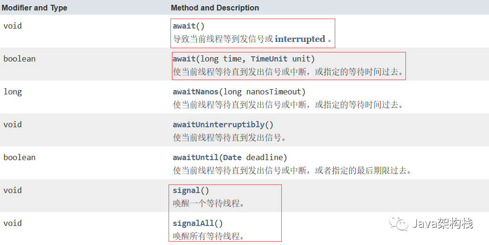
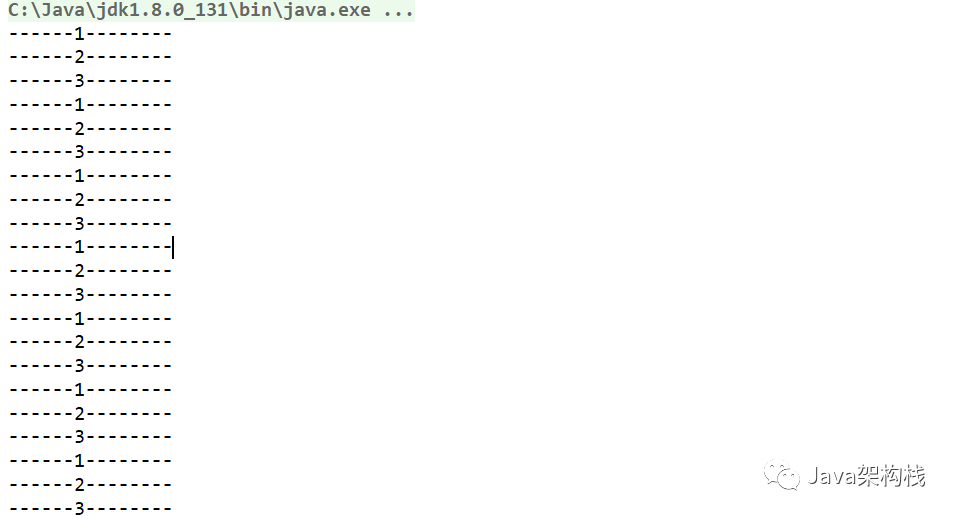

# [如何使用ReentrantLock的条件变量，让多个线程顺序执行？](https://blog.csdn.net/finally_vince/article/details/127731468)

> ReentrantLock 中的条件变量功能，类似于普通 synchronized 的 wait、notify，我们可以使用Reentrantlock 锁，配合 Condition 对象上的 await()和 signal()或 signalAll()方法，来实现线程间协作。与synchronized的wait和notify不同之处在于，ReentrantLock中的条件变量可以有多个，可以实现更精细的控制线程。今天耀哥先使用ReentrantLock 的条件变量来实现这个题目中的需求。_reentrantlock 多条件

**一. 前言**

近日耀哥的一个学生在参加某公司校招面试时，遇到一个多个线程顺序执行的面试题，特意记录下来和大家分享一下，这个题目的具体要求是这样的：

**假设有3个线程 a,b,c，要求三个线程一起进入到就绪态，执行时一定要按照 a-->b-->c的顺序执行。即使a或者b线程进入到了阻塞态，也一定会按照a-->b-->c的顺序运行线程。请问该如何保证实现这个需求呢？**

**二. 解决方案**

关于这道题，耀哥[百度一下](https://so.csdn.net/so/search?q=百度一下&spm=1001.2101.3001.7020)网上常见的实现思路，大致有4种解决方案：

> 1. 通过join()方法使当前线程“阻塞”，等待指定线程执行完毕后继续执行；
> 2. 通过倒数计时器[CountDownLatch](https://so.csdn.net/so/search?q=CountDownLatch&spm=1001.2101.3001.7020)实现；
> 3. 通过创建单一化线程池 newSingleThreadExecutor()实现；
> 4. 通过ReentrantLock 中的[条件变量](https://so.csdn.net/so/search?q=条件变量&spm=1001.2101.3001.7020)实现；

今天耀哥先使用ReentrantLock 的条件变量来实现这个题目中的需求。

**三. 使用ReentrantLock 条件变量**

首先咱们来了解一下，什么是ReentrantLock 条件变量(Condition)。

> ReentrantLock 中的条件变量功能，类似于普通 synchronized 的 wait、notify，我们可以使用Reentrantlock 锁，配合 Condition 对象上的 await()和 signal()或 signalAll()方法，来实现线程间协作。与synchronized的wait和notify不同之处在于，ReentrantLock中的条件变量可以有多个，可以实现更精细的控制线程。

Condition中常用的方法API有如下这些：



ReentrantLock代码实现：

```csharp
class ShareDataLock{
    // 线程执行的条件 1：线程1执行 2：线程2执行 3：线程3执行
    int number =1;
    // 锁
    Lock lock = new ReentrantLock();
    // 从锁中获得3个条件变量
    Condition condition1 = lock.newCondition();
    Condition condition2 = lock.newCondition();
    Condition condition3 = lock.newCondition();
 
    // 第一个线程run之后执行的方法
    public void f1(){
        lock.lock();
        try {
            // 如果条件值不为1 就挂起等待
            while(number!=1){
                condition1.await();
            }
            // 故意阻塞100毫秒，看看其他的线程会不会不再排队
            Thread.sleep(100);
            System.out.println("------1--------");
            // 线程1 执行完毕 把变量设置为2
            number = 2;
            // 唤醒第2个条件变量
            condition2.signal();
        } catch (Exception e) {
          e.printStackTrace();
        } finally {
            // 不管抛没抛出异常都要解锁，防止线程死锁
          lock.unlock();
        }
    }
    
    public void f2(){
        lock.lock();
        try {
            while(number!=2){
                condition2.await();
            }
            System.out.println("------2--------");
            number = 3;
            condition3.signal();
        } catch (Exception e) {
            e.printStackTrace();
        } finally {
            lock.unlock();
        }
    }
    
    public void f3(){
        lock.lock();
        try {
            while(number!=3){
                condition3.await();
            }
            System.out.println("------3--------");
            number = 1;
            condition1.signal();
        } catch (Exception e) {
            e.printStackTrace();
        } finally {
            lock.unlock();
        }
    }
}
 
public class SynchronizedAndReentrantLockDemo {
 
    public static void main(String[] args) {
        ShareDataLock shareDataLock = new ShareDataLock();
        for (int i = 0; i < 10; i++) {
            // 3个线程分别执行1,2,3 3个方法 ，并且同时就绪
            new Thread(()->shareDataLock.f1(),"AA").start();
            new Thread(()->shareDataLock.f2(),"bb").start();
            new Thread(()->shareDataLock.f3(),"cc").start();
        }
 
    }
}
```

代码执行效果如下图：



现在我们就会发现，3个线程已经可以被随意控制了，你会了吗？

**四. 后话**

如上文所述，让多个线程按顺序执行，网上常见的解决方案有4种。但大家要注意的是，面试官出这个题有一个先决条件，“**要让所有的线程同时就绪****”**，所以我们就可以排除使用join方法和使用单一化线程池的方案了。那么要想实现这个面试题中的需求，比较靠谱的方法**只剩下ReentrantLock 中的条件变量和使用倒数计时器CountDownLatch两种方案了****。****今天咱们暂时先介绍条件变量的方法，耀哥****会****在日后的文章中介绍怎样使用CountDownLatch****，****让多个线程有序执行，**敬请各位粉丝儿们继续期待哦。