# [mybatis plus框架的@TableField注解不生效问题总结](https://blog.csdn.net/HongYu012/article/details/123301153)

## 一、问题描述

最近遇到一个mybatis plus的问题，@[TableField注解](https://so.csdn.net/so/search?q=TableField注解&spm=1001.2101.3001.7020)不生效，导致查出来的字段反序列化后为空

数据库表结构：

```pgsql
CREATE TABLE `client_role` (
  `id` int(11) NOT NULL AUTO_INCREMENT COMMENT '自增主键',
  `name` varchar(64) NOT NULL COMMENT '角色的唯一标识',
  `desc` varchar(64) DEFAULT NULL COMMENT '角色描述',
  PRIMARY KEY (`id`)
) ENGINE=InnoDB DEFAULT CHARSET=utf8mb4 COMMENT='角色表'
```

对应的实体类

```kotlin
@Data
@EqualsAndHashCode(callSuper = false)
@Accessors(chain = true)
@TableName("client_role")
@ApiModel(value = "ClientRole对象", description = "角色表")
public class ClientRole implements Serializable {
    private static final long serialVersionUID = 1L;

    /**
     * 自增主键
     */
    @ApiModelProperty(value = "自增主键")
    @TableId(value = "id", type = IdType.AUTO)
    private Long id;

    /**
     * 角色的唯一标识
     */
    @NotEmpty
    @ApiModelProperty(value = "角色的唯一标识")
    @TableField("name")
    private String name;

    /**
     * 角色描述
     */
    @ApiModelProperty(value = "角色描述")
    @TableField("`desc`")
    private String description;

}
```

就是description字段为空的问题，查询sql如下

```pgsql
<select id="selectOneByName" resultType="com.kdyzm.demo.springboot.entity.ClientRole">
    select *
    from client_role
    where name = #{name};
  </select>
```

然而，如果不手写sql，使用mybatis plus自带的LambdaQuery查询，则description字段就有值了。

```perl
ClientRole admin = iClientRoleMapper.selectOne(
    new LambdaQueryWrapper<ClientRole>().eq(ClientRole::getName, "admin")
);
```

真是活见鬼，两种方法理论上结果应该是一模一样的，最终却发现@TableField字段在手写sql这种方式下失效了。

## 二、解决方案

定义ResultMap，在xml文件中定义如下

```applescript
<resultMap type="com.kdyzm.demo.springboot.entity.ClientRole" id="ClientRoleResult">
    <result property="id" column="id"/>
    <result property="name" column="name"/>
    <result property="description" column="desc"/>
  </resultMap>

  <select id="selectOneByName" resultMap="ClientRoleResult">
    select *
    from client_role
    where name = #{name};
  </select>
```

select标签中resultType改成resultMap，值为resultMap标签的id，这样description字段就有值了。

问题很容易解决，但是有个问题需要问下为什么：为什么@TableField注解在手写sql的时候就失效了呢？

## 三、关于@TableField注解失效原因的思考

当数据库字段和自定义的实体类中字段名不一致的时候，可以使用@TableField注解实现矫正，以上面的代码为例，

```perl
ClientRole admin = iClientRoleMapper.selectOne(
    new LambdaQueryWrapper<ClientRole>().eq(ClientRole::getName, "admin")
);
```

这段代码被翻译成sql，它被翻译成这样

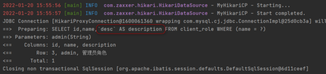

好家伙，原来@TableField注解功能是通过加别名实现的。

那如果是手写sql的话，它如何把别名加上去呢？答案就是没办法加上去，因为手写sql太灵活了，不在mybatis plus功能框架内，那是属于原生mybatis的功能范畴，不支持也就正常了。

## 四、Mapper接口LambdaQuery方法调用过程梳理

进一步探讨，@TableField注解是如何生成别名的呢，那就要研究下源码了。

### 1、Mapper接口调用实际上使用的是动态代理技术

mybatis定义的都是一堆的接口，并没有实现类，但是却能正常调用，这很明显使用了动态代理技术，实际上注入spring的时候接口被包装成了代理对象，这就为debug源码提供了突破口。

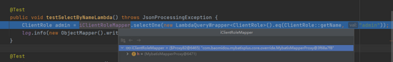

可以看到，这个代理对象实际的类名为 `com.baomidou.mybatisplus.core.override.MybatisMapperProxy` ,它实现了InvocationHandler接口，确定是JDK动态代理无疑了，那么所有的逻辑都会走 `com.baomidou.mybatisplus.core.override.MybatisMapperProxy#invoke` 方法

### 2、mybatis plus对查询的单独处理

根据上面一步找到源码的入口，一步一步走下去，接口调用到了 `com.baomidou.mybatisplus.core.override.MybatisMapperMethod#execute` 方法

```reasonml
public Object execute(SqlSession sqlSession, Object[] args) {
        Object result;
        switch (command.getType()) {
            case INSERT: {
                Object param = method.convertArgsToSqlCommandParam(args);
                result = rowCountResult(sqlSession.insert(command.getName(), param));
                break;
            }
            case UPDATE: {
                Object param = method.convertArgsToSqlCommandParam(args);
                result = rowCountResult(sqlSession.update(command.getName(), param));
                break;
            }
            case DELETE: {
                Object param = method.convertArgsToSqlCommandParam(args);
                result = rowCountResult(sqlSession.delete(command.getName(), param));
                break;
            }
            case SELECT:
                if (method.returnsVoid() && method.hasResultHandler()) {
                    executeWithResultHandler(sqlSession, args);
                    result = null;
                } else if (method.returnsMany()) {
                    result = executeForMany(sqlSession, args);
                } else if (method.returnsMap()) {
                    result = executeForMap(sqlSession, args);
                } else if (method.returnsCursor()) {
                    result = executeForCursor(sqlSession, args);
                } else {
                    // TODO 这里下面改了
                    if (IPage.class.isAssignableFrom(method.getReturnType())) {
                        result = executeForIPage(sqlSession, args);
                        // TODO 这里上面改了
                    } else {
                        Object param = method.convertArgsToSqlCommandParam(args);
                        result = sqlSession.selectOne(command.getName(), param);
                        if (method.returnsOptional()
                            && (result == null || !method.getReturnType().equals(result.getClass()))) {
                            result = Optional.ofNullable(result);
                        }
                    }
                }
                break;
            case FLUSH:
                result = sqlSession.flushStatements();
                break;
            default:
                throw new BindingException("Unknown execution method for: " + command.getName());
        }
        if (result == null && method.getReturnType().isPrimitive() && !method.returnsVoid()) {
            throw new BindingException("Mapper method '" + command.getName()
                + " attempted to return null from a method with a primitive return type (" + method.getReturnType() + ").");
        }
        return result;
    }
```

这段代码特点在于它对于非查询类型的请求（比如插入、更新和删除），都直接委托给了sqlSeesion的相应的方法调用，而对于查询请求，则逻辑比较复杂，毕竟sql最复杂的地方就是查询了；还有另外一个特点，针对不同的返回结果类型，也走不同的逻辑；由于我这里查询返回的是一个实体对象，所以最终走到了如下断点

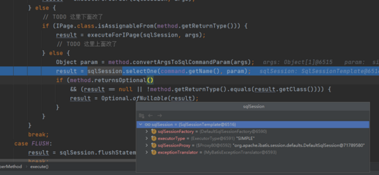

从代码上来看，也只是委托给了SqlSessionTemplate对象处理了，然而SqlSessionTemplate的全包名是 `org.mybatis.spring.SqlSessionTemplate` ，它是mybatis集成spring的官方功能，和mybatis plus没关系，就这如何能让@TableField注解发挥作用呢？

### 3、findOne实际上还是要查询List

继续debug几次，到了一个有趣的方法 `org.apache.ibatis.session.defaults.DefaultSqlSession#selectOne(java.lang.String, java.lang.Object)`

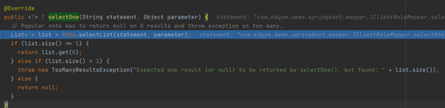

原来单独查询一个对象，还是要查询List，然后取出第一个对象返回；如果查询出多个对象，则直接抛出 `TooManyResultsException` ，建表的时候不做唯一索引查出来多个对象的时候抛出的异常就是在这里做的。

有意思的是，方法执行到这里，传参只有两个，一个是方法名，另外一个是查询参数

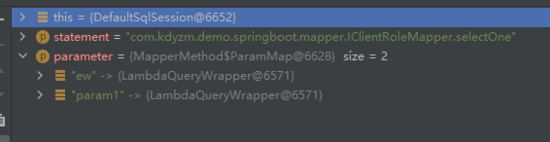

总之还是要继续查看selectList的逻辑，才能搞清楚逻辑

### 4、mybatis接口上下文信息MappedStatement

上一步说到selectList方法调用只传递了两个参数，一个是方法名，一个是方法参数，只是这两个参数是无法满足查询的请求的，毕竟最重要的sql语句都没传，debug下去，到了一处比较重要的地方，就解开了我的疑问： `org.apache.ibatis.session.defaults.DefaultSqlSession#selectList(java.lang.String, java.lang.Object, org.apache.ibatis.session.RowBounds)`

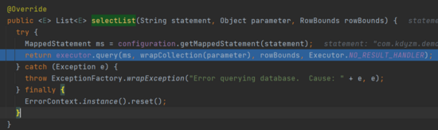

在这个方法里，根据statement也就是方法名获取到了MappedStatement对象，这个对象里存储着这个关于本次查询需要的上下文信息，继续debug，来到一个方法 `com.baomidou.mybatisplus.core.executor.MybatisCachingExecutor#query(org.apache.ibatis.mapping.MappedStatement, java.lang.Object, org.apache.ibatis.session.RowBounds, org.apache.ibatis.session.ResultHandler)`

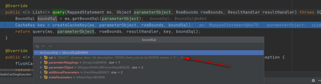

它调用了MappedStatement对象的getBoundSql方法，便得到了带有别名的sql字符串，也就是说，这个getBoundSql方法形成了这段sql字符串，debug进去看看

### 5、mybatis plus别名自动设置的逻辑

debug ms.getBoundSql方法，最终到了方法： `org.apache.ibatis.scripting.xmltags.MixedSqlNode#apply` ，该方法入参是 `org.apache.ibatis.scripting.xmltags.DynamicContext` 类型，其内部维护了一个 `java.util.StringJoiner` 对象，专门用于拼接sql

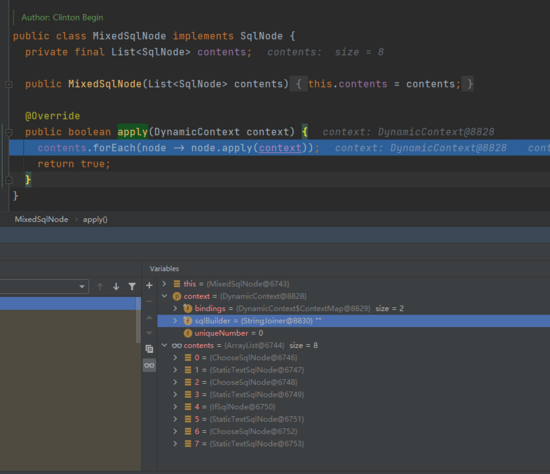

contents对象是个List类表，其有八个元素，经过八个元素的apply方法调用之后，DynamicContext的sqlBuilder对象就有了值了

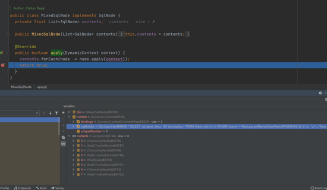

原来别名是在这里设置的；这里先暂且不谈，查询流程还没结束，先看整个的流程。

### 6、mybatis plus的sql日志打印

我们看到的sql日志是如何打印出来的？上一步已经获取到了sql，接下来继续debug，就会看到sql打印的代码： `org.apache.ibatis.logging.jdbc.ConnectionLogger#invoke`

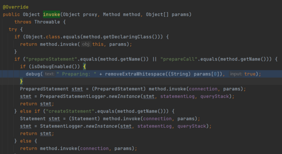

### 7、最终查询的执行

我们知道，无论是mybatis还是其它框架，最终执行查询都要遵循java api规范，上一步已经获取到了PreparedStatement，最终在这个方法执行了查询

```
org.apache.ibatis.executor.statement.PreparedStatementHandler#query
```

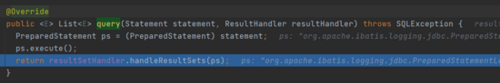

### 8、结果集处理

查询完之后要封装结果集，封装逻辑的起始方法： `org.apache.ibatis.executor.resultset.DefaultResultSetHandler#handleResultSets`

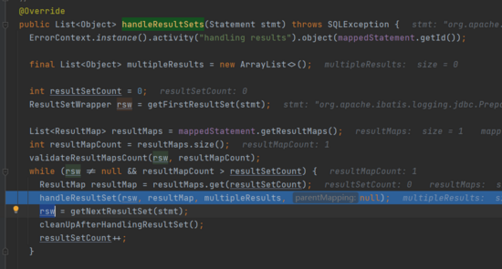

可以看到，这段逻辑就是在从Satement对象中循环取数据，然后调用org.apache.ibatis.executor.resultset.DefaultResultSetHandler#handleResultSet方法处理每一条数据

### 9、每一条数据的单独处理

继续debug，可以看到对每一条结果数据的单独处理的逻辑： `org.apache.ibatis.executor.resultset.DefaultResultSetHandler#getRowValue(org.apache.ibatis.executor.resultset.ResultSetWrapper, org.apache.ibatis.mapping.ResultMap, java.lang.String)`

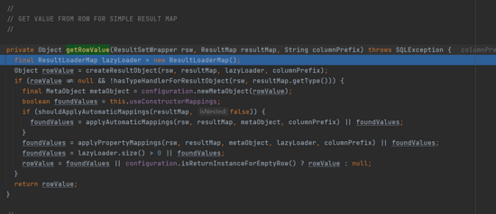

这里首先使用自动字段名映射的方式填充返回值，然后使用resultMap继续填充返回值，最后返回rowValue作为最终[反序列化](https://so.csdn.net/so/search?q=反序列化&spm=1001.2101.3001.7020)完成的值。

至此，整个查询过程基本上就结束了。

## 五、@TableField注解生效原理

### 1、别名sql在mapper方法执行前就已经确定

上一步在梳理Mapper接口调用过程的时候在第5点说过，DynamicContext内部维护了一个StringJoiner对象用于拼接sql，在经过MixedSqlNode内部的8个SqlNode处理之后，StringJoiner就有了完整的sql语句。我们知道@TableField生效的原理是设置别名，那么别名是这时候设置上去的吗？

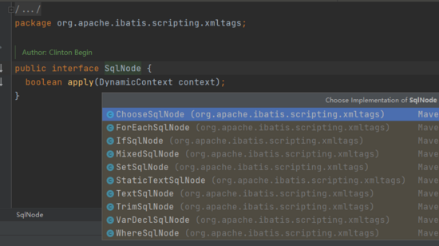

SqlNode有很多实现类，目测mybatis通过实现SqlNode接口实现对XML语法的支持。里面最简单的SqlNode就是StaticTextSqlNode了

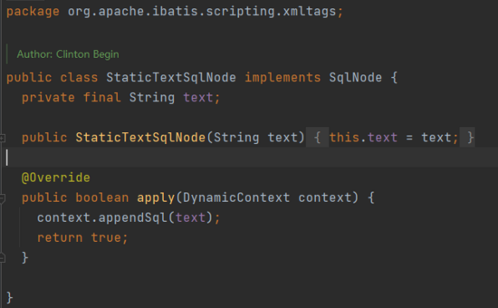

可以看到这个类内部维护了一个text字符串，然后将这个text字符串挂到DynamicContext的StringJoiner，就是这么简单的逻辑，然而别名sql就是在这里设置上去的：

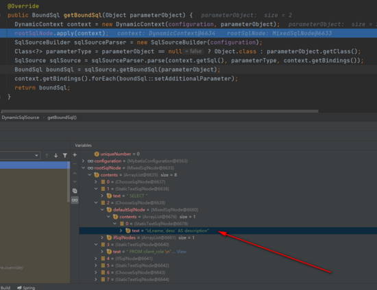

答案已经一目了然了，代码在执行到这里的时候，这个StaticTextSqlNode里面的text就已经准备好了sql了，等到它执行apply方法的时候直接就给挂到了DynamicConetxt的StringJoiner， 这说明了别名sql的设置在Mapper方法执行之前就已经确定了，而非是代码执行过程中动态的解析 。

### 2、@TableField注解的外层解析

@TableFied注解何时被解析？可以推测肯定是mybatis plus starter搞的鬼，但是入口方法调用链很长，找到解析点会比较困难，最直接的方法就是在借助intelij工具，右键注解，findUseage，自然就找到了这个解析方法： `com.baomidou.mybatisplus.core.metadata.TableInfoHelper#initTableFields` 。在该方法上打上断点，debug模式启动服务，就找到了调用链

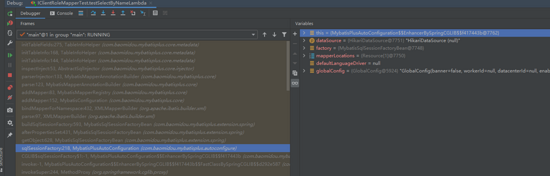

可以看到，一切的起点就在 `com.baomidou.mybatisplus.autoconfigure.MybatisPlusAutoConfiguration` 配置类，在方法 `com.baomidou.mybatisplus.autoconfigure.MybatisPlusAutoConfiguration#sqlSessionFactory` 中创建SqlSessionFactory时开启整个的解析流程，整个流程非常复杂，最终会调用到 `com.baomidou.mybatisplus.core.injector.AbstractSqlInjector#inspectInject` 方法，在执行完成 `com.baomidou.mybatisplus.core.metadata.TableInfoHelper#initTableInfo` 方法之后，TableInfo对象中的fiedList就已经存储了数据库字段和实体字段的映射关系：

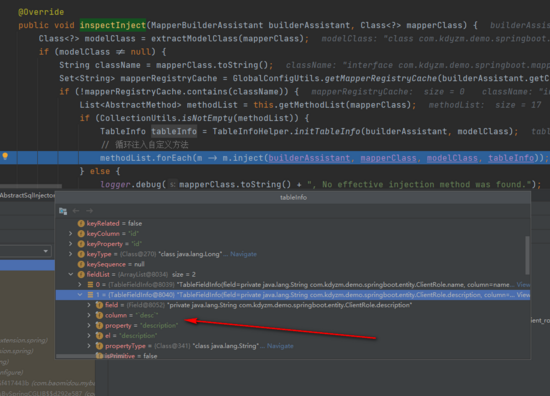

initTableInfo方法内部解析了@TableField注解，并且生成了数据库字段和实体字段的映射关系，并最终保存到了TableInfo对象。

然而，这个实体对象无法直接使用，因为在前面Mapper接口调用梳理的过程中就知道了，在拼接sql的时候别名已经以sql的形式存储在了StaticTextSqlNode，还要继续debug寻找转换点

### 3、MappedStatement对象创建和保存

紧接着要执行的代码在循环注入自定义方法这块，上一步解析好的TableInfo会被应用到以下十七种内置方法，这和我们常用的 `com.baomidou.mybatisplus.core.mapper.BaseMapper` 接口中的方法数量是相同的，当然也就不包括手写sql的那个自定义方法。

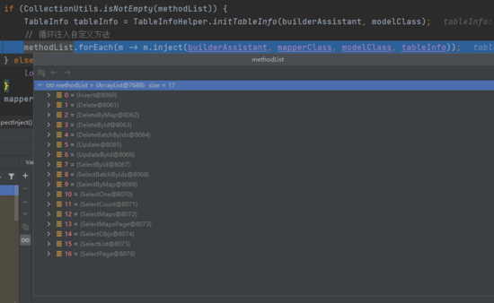

在循环体上打上断点，看看这个inject方法做了什么事情，由于我们只关心 `com.baomidou.mybatisplus.core.injector.methods.SelectOne` ，所以直接进入SelectOne的inject方法打上断点

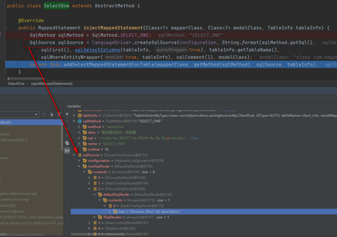

好家伙，这个sqlSource可太眼熟了，基本上可以确定这个和上面分析的 `5、mybatis plus别名自动设置的逻辑` 中的DynamicSqlSource是同一个对象，如果将其放到MappedStatement对象内，那就和Mapper接口方法执行的流程对的上了，从接下来执行的方法addSelectMappedStatementForTable名字上来看，做的也正是这个事情，继续debug，最终到了方法 `org.apache.ibatis.builder.MapperBuilderAssistant#addMappedStatement`

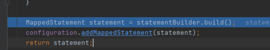

该方法创建了MappedStatement对象，并且存储到了全局Configuration对象。这样，在执行Mapper接口方法的时候，根据上面梳理的执行流程中的 `4、mybatis接口上下文信息MappedStatement` ，就可以在configuration对象中取出MappedStatement对象用于查询了，这样，就整个串通了@TableFied注解的作用过程。


### 4、一些疑问

上面梳理了LambdaQuery接口执行的过程以及确定了@TableField注解在这个过程中是通过给字段起别名的方式实现了数据库字段和实体字段的映射。其实还有几处疑问需要解决

1、为啥手写sql@TableField注解就失效了呢？虽然在 `三、关于@TableField注解失效原因的思考` 中大体上明白了失效的合理性，但是从技术层面上来讲只是搞明白了内置方法对@TableFied注解的支持，还没搞明白手写sql为啥不支持@TableFied注解。再具体点，手写sql肯定是没有别名的，那它的DynamicSqlSource和内置方法的DynamicSqlSource有何不同？手写sql需要定义ResultMap，ResultMap在何时生效的？退一步说，手写sql和内置方法的查询是否走的同一个查询流程呢？

2、使用LambdaQuery的内置方法通过下面的代码生成MappedStatement对象并且保存到Configuration全局配置中，手写的sql并不在这个列表中，手写sql的接口方法何时创建的MappedStatement对象的呢？


## 六、Mapper接口手写sql方法调用过程梳理

整个流程基本上和 `四、Mapper接口LambdaQuery方法调用过程梳理` 一样，这里只是说下不同之处

### 1、生成sql的方式不同

在LambdaQuery中，生成sql的方式是使用DynamicSqlSource

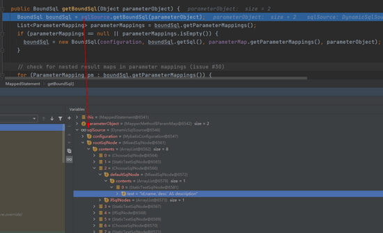

其内部维护了一个rootSqlNode用于解析sql语句，其中查询列包含别名被放到了一个StaticTextSqlNode中；

但是在手写sql的时候，不再是DynamicSqlSource，而是RawSqlSource：

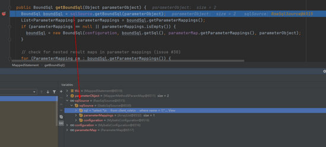

内部不再维护MixedSqlNode,而是直接使使用一个sql字符串，该字符串正是xml文件中手写的sql：

```pgsql
<select id="selectOneByName" resultMap="ClientRoleResult">
    select *
    from client_role
    where  name = #{name};
  </select>
```

很明显，这里确实是原生的sql，没有任何的mybatis标签混杂在里面。

假如我稍微改一下这段sql又如何？改成如下形式

```pgsql
<select id="selectOneByName" resultMap="ClientRoleResult">
    select *
    from client_role
    <where>
      name = #{name};
    </where>
  </select>
```

两段代码逻辑上是完全一样的，再次运行debug到此处

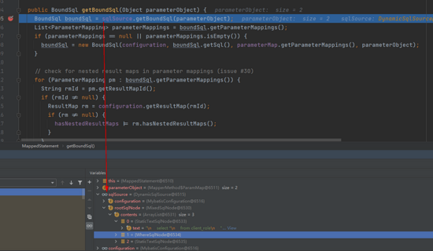

可以看到，sqlSource已经变成了DynamicSqlSource，只是它相对于LambdaQuery的查询方式，少了很多个SqlNode节点。虽然变成了DynamicSqlSource，但是可以看到还是没有设置别名，StaticTextSqlNode中存储了xml文件中写的原始的sql字符串。

这样可以得出结论：如果xml文件中写的sql没有使用任何mybatis的标签，则会使用RawSqlSource，如果使用了例如 `<where></where>` 等标签，则会使用DynamicSqlSource；同样使用的都是DynamicSqlSource的情况下，手写Sql的DynamicSqlSource查询列不会自动增加别名，查询列取决于手写sql的代码。

需要注意的是执行这段代码的是 `org.apache.ibatis.mapping.MappedStatement` 对象，它是在服务启动的时候创建并保存到全局MybatisConfiguration中的，也就是说，在服务启动的时候就已经决定了在这里查询的时候使用的是DynamicSqlSource还是RawSqlSource。

### 2、结果集处理方式不同

之前说过，即使是查询一个元素，底层还是会查询List，然后对每个元素单独反序列化封装成实体类对象，这个操作在 `org.apache.ibatis.executor.resultset.DefaultResultSetHandler#getRowValue(org.apache.ibatis.executor.resultset.ResultSetWrapper, org.apache.ibatis.mapping.ResultMap, java.lang.String)` 方法中。

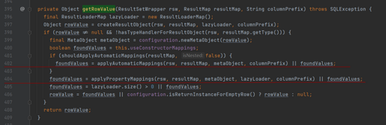

需要注意的是402行的applyAutomaticMappings方法执行以及404行的applyPropertyMappings方法执行

当使用LambdaQuery查询的时候，402行代码返回的foundValues值为true，方法执行完成，rowValue就有值了，见下图：

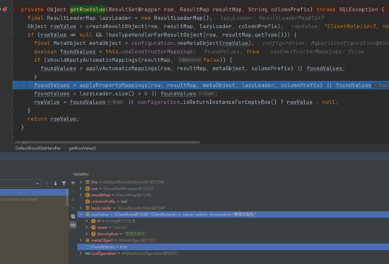

404行的applyPropertyMappings方法执行则会直接跳过执行，因为不满足执行条件；

而当手写sql方法调用时，402行的applyAutomaticMappings方法执行会返回false，执行完成之后rowValue字段属性并没有填充，见下图：

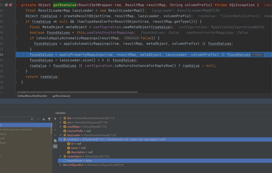

而404行的applyPropertyMappings方法满足了执行条件，执行完成之后foundValues的值变成了true，而rawValue也有值了。

为啥呢？

applyAutomaticMappings方法和applyPropertyMappings方法两个方法从方法名字上来看似乎是对立的两个方法如果未指定PropertieyMapping，则走applyAutomacitMapping，如果指定了则走applyPropertyMapping，但是会不会同时存在两个方法都走一遍呢？那是肯定的，因为applyPropertyMapping并没有放在else块中，它是强制执行的，为了验证这个问题，修改下Xml文件中定义的ResultMap，原来ResultMap长这样子

```abnf
<resultMap type="com.kdyzm.demo.springboot.entity.ClientRole" id="ClientRoleResult">
    <result property="id" column="id"/>
    <result property="name" column="name"/>
    <result property="description" column="desc"/>
  </resultMap>
```

现在我改成这个样子

```abnf
<resultMap type="com.kdyzm.demo.springboot.entity.ClientRole" id="ClientRoleResult">
    <result property="description" column="desc"/>
  </resultMap>
```

删掉表字段和实体字段同名的映射关系，只留下不同的映射关系，再次执行手写sql的接口查询。

执行完成applyAutomaticMappings方法之后，未在ResultMap中指定映射关系的id和name两个属性填充上了值，如下图：

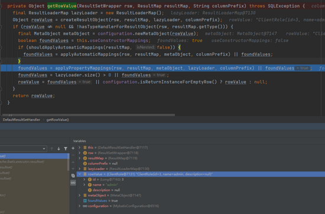

执行完成applyPropertyMappings方法之后，在ResultMap中定了映射关系的description字段填充上了值，如下图：

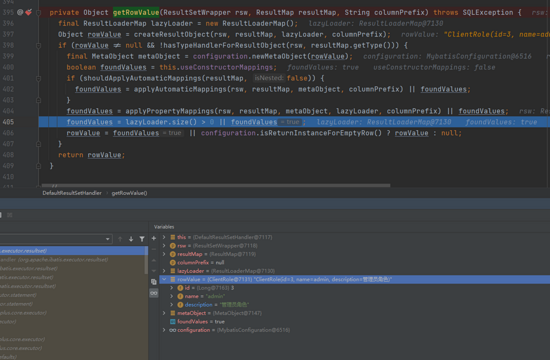

说明了一个问题： 只要在ResultMap中没定义映射关系，就会被applyAutomaticMappings方法处理属性填充；如果在ResultMap中定义了映射关系，则会被applyPropertyMappings方法处理属性填充；另外，说明了ResultMap不需要全部都写上关系映射，只需要写数据库字段名和实体类字段不一致的映射即可。

那么如何区分出来哪些字段该走applyAutomaticMappings方法属性填充，哪些字段该走applyPropertyMappings属性填充呢？

答案就在传过来的resultMap对象中，它有个属性叫ResultMapping，存储着解析XML文件中ResultMap的映射，如下图所示：

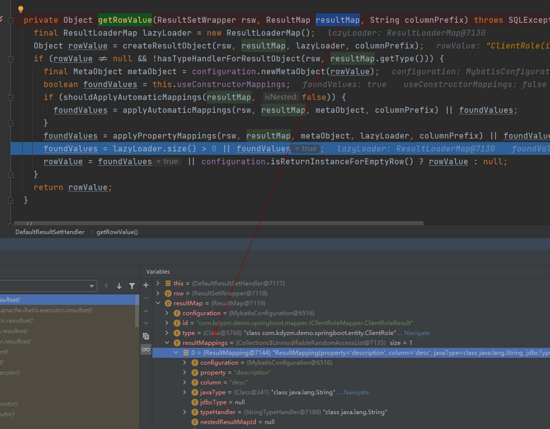

凡是在resultMapping中的属性，都走applyPropertyMappings方法，否则走applyAutomaticMappings方法。

### 3、手写sql接口方法@TableFied注解失效的原因

一开始未在xml文件中定义ResultMapping，且使用的是手写sql。根据上面的源码分析，在未定义ResultMap的情况下，所有的属性填充都会走 `org.apache.ibatis.executor.resultset.DefaultResultSetHandler#applyAutomaticMappings` 方法，其逻辑也比较清晰


```angelscript
List<UnMappedColumnAutoMapping> autoMapping
```

套用上述流程，看看description字段为啥没填充上去：

1. 首先查找出所有未在xml文件中定义的ResultMap映射表字段集合，找到了id,name,desc三个表字段
2. 对这些表字段进行处理，比如如果开启了mapUnderscoreToCamelCase，则会将表字段从下换线变成驼峰命名，三个字段都无变化
3. 尝试从实体类寻找转换好的字段，如果找到了，则全部放到 `List<UnMappedColumnAutoMapping> autoMapping` ，实体类有三个字段id,name,description，id，name都找到了，由于desc和description长得不一样，所以就没填充到 `List<UnMappedColumnAutoMapping> autoMapping` ，最终上图中只有id和name两个属性值被add到了autoMapping。
4. 从mapping寻找适合的typeHandler解析属性值，这里只解析了id和name两个字段的属性值
5. 属性值填充到rawValue，这里只填充了id和name两个字段的属性值

总结下，desc字段因为没有在ResultMap中定义，所以不会被applyPropertyMappings方法处理；本来应该被applyAutomaticMappings处理的，又因为和description实体类字段名长得不一样，就被applyAutomaticMappings方法忽略了，成了一个两不管的状态，所以最终只能是默认值填充，那就是null了。

那么@TableFied字段真的一点用就没了吗，上述流程中代码中怎么知道数据库表字段的呢？

表字段都被封装到了ResultSetWrapper对象中，如下图所示

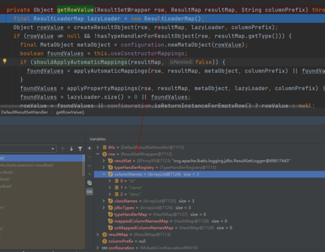

这些表字段是从执行结果ResultSet中的元数据获取到的，最终通过构造方法填充属性值，如下图所示

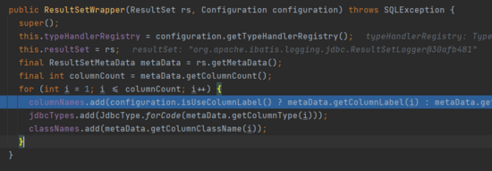

所以，当手写sql的时候，@TableField注解就真的完全没用了。

下面说下手写sqlmapper方法创建对应MappedStatement对象的过程。

### 4、手写SQL的MappedStatement对象的创建

同样的，手写sql的MappedStatement对象的创建也是在SqlSessionFactoryBean对象创建的过程中创建的。但是手写SQL的MappedStatement对象创建的时间远比mybatis plus内置方法的创建早的多。

创建SqlSessionFactoryBean的入口方法： `com.baomidou.mybatisplus.extension.spring.MybatisSqlSessionFactoryBean#buildSqlSessionFactory`

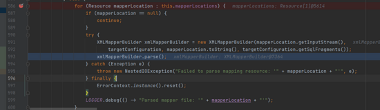

这段代码会解析所有的xml文件并且最终在 `org.apache.ibatis.builder.MapperBuilderAssistant#addMappedStatement` 方法中创建手写sql的MapperStatement并保存到Configuration上下文中。

## 七、手写SQL如何让@TableFiled生效

如果，我就是想手写SQL，还不想写ResultMap而且还想@TableField注解生效，又该怎么做呢？


先说下结论：理论上可行，实践很困难。下面逐一分析各种方法的可行性。

### 1、方法一：新增ResultMapping

通过上面的源码分析，知道了mybatis针对每个Mapper接口都创建了一个MappedStatement对象，该对象实际上存储了该接口的上下文信息，无论是执行的sql还是结果类型、字段Mapping等都在里面（不包含ResultSet返回的行动态AutoMapping），在反序列化之前修改该对象，根据@TableFied注解新增数据库字段和实体类字段的映射关系，就应该能影响反序列化结果。

然而，我发现所有相关的属性都被修饰成了不可修改的集合，这里有个最关键的resultMappings集合，也被修饰成了不可修改的集合，看起来官方并不想我们动他们的数据，毕竟万一出了问题，就很难排查是谁导致的了。

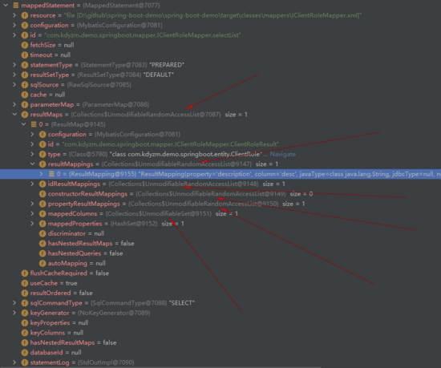

所以说，这种方式行不通。

### 2、方法二：使用插件填充未被设置值的属性

如果没设置ResultMap，会使用自动映射的方式填充实体类对象，desc和descriptin字段的映射则会失败，最终到实体类对象里descriptin字段就为空。若是基于此结果，再做处理，将为空的值尝试使用@TableFiled注解做映射再次填充，理论上也是可行的，所以我使用mybatis插件的方式重新处理了结果：

```java
import com.baomidou.mybatisplus.annotation.TableField;
import lombok.AllArgsConstructor;
import lombok.Data;
import lombok.extern.slf4j.Slf4j;
import org.apache.ibatis.executor.resultset.DefaultResultSetHandler;
import org.apache.ibatis.executor.resultset.ResultSetHandler;
import org.apache.ibatis.executor.resultset.ResultSetWrapper;
import org.apache.ibatis.mapping.MappedStatement;
import org.apache.ibatis.mapping.ResultMap;
import org.apache.ibatis.plugin.*;
import org.apache.ibatis.session.Configuration;
import org.apache.ibatis.type.JdbcType;
import org.apache.ibatis.type.TypeHandler;
import org.springframework.util.CollectionUtils;

import java.lang.reflect.Field;
import java.lang.reflect.Method;
import java.lang.reflect.Modifier;
import java.sql.ResultSet;
import java.sql.SQLException;
import java.sql.Statement;
import java.util.*;

/**
 * @author kdyzm
 * @date 2022/1/24
 */
@Slf4j
@Intercepts({
    @Signature(
        type = ResultSetHandler.class,
        method = "handleResultSets",
        args = {Statement.class}
    )
})
public class ResultSetHandlerPlugin implements Interceptor {

    private final Map<String, List<UnMappedColumnMapping>> unMappedColumnMappingCache = new HashMap<>();

    private ResultSetWrapper getFirstResultSet(Statement stmt, Configuration configuration) throws SQLException {
        ResultSet rs = stmt.getResultSet();
        while (rs == null) {
            // move forward to get the first resultset in case the driver
            // doesn't return the resultset as the first result (HSQLDB 2.1)
            if (stmt.getMoreResults()) {
                rs = stmt.getResultSet();
            } else {
                if (stmt.getUpdateCount() == -1) {
                    // no more results. Must be no resultset
                    break;
                }
            }
        }
        return rs != null ? new ResultSetWrapper(rs, configuration) : null;
    }

    @Override
    public Object intercept(Invocation invocation) throws Throwable {
        //通过StatementHandler获取执行的sql
        DefaultResultSetHandler statementHandler = (DefaultResultSetHandler) invocation.getTarget();
        MappedStatement mappedStatement = getMappedStatement(statementHandler);
        Configuration configuration = mappedStatement.getConfiguration();
        Object[] args = invocation.getArgs();
        Method method = invocation.getMethod();
        Statement statement = (Statement) invocation.getArgs()[0];
        ResultSetWrapper firstResultSet = getFirstResultSet(statement, configuration);
        List result = (List) invocation.proceed();
        //获得结果集
        ResultMap resultMap = mappedStatement.getResultMaps().get(0);
        List<UnMappedColumnMapping> unMappedColumnMappings = getUnMappedColumnMapping(firstResultSet, resultMap);
		//TODO 
        return result;
    }

    private List<UnMappedColumnMapping> getUnMappedColumnMapping(ResultSetWrapper firstResultSet, ResultMap resultMap) {
        Class clazz = resultMap.getType();
        List<UnMappedColumnMapping> unMappedColumnMappings = this.unMappedColumnMappingCache.get(clazz.getName());
        if (!CollectionUtils.isEmpty(unMappedColumnMappings)) {
            return unMappedColumnMappings;
        }
        unMappedColumnMappings = new ArrayList<>();

        Set<String> mappedProperties = resultMap.getMappedProperties();
        Field[] fields = clazz.getDeclaredFields();
        for (Field field : fields) {
            if (Modifier.isFinal(field.getModifiers())
                || Modifier.isStatic(field.getModifiers())
                || Modifier.isVolatile(field.getModifiers())
            ) {
                continue;
            }
            String fieldName = field.getName();
            boolean contains = mappedProperties.contains(fieldName);
            if (contains) {
                continue;
            }
            TableField annotation = field.getAnnotation(TableField.class);
            if (Objects.isNull(annotation)) {
                continue;
            }
            String columnName = annotation.value();
            TypeHandler<?> typeHandler = firstResultSet.getTypeHandler(field.getType(), columnName);
            if (Objects.isNull(typeHandler)) {
                log.error("不支持的字段反序列化：{}", columnName);
            } else {
                log.info("字段={}使用的反序列化工具为：{}", columnName, typeHandler);
                UnMappedColumnMapping unMappedColumnMapping = new UnMappedColumnMapping(
                    columnName,
                    field.getName(),
                    typeHandler
                );
                unMappedColumnMappings.add(unMappedColumnMapping);
            }
        }
        this.unMappedColumnMappingCache.put(clazz.getName(), unMappedColumnMappings);
        return unMappedColumnMappings;
    }

    private MappedStatement getMappedStatement(DefaultResultSetHandler statementHandler) throws NoSuchFieldException, IllegalAccessException {
        Field field = statementHandler.getClass().getDeclaredField("mappedStatement");
        field.setAccessible(true);
        MappedStatement mappedStatement = (MappedStatement) field.get(statementHandler);
        return mappedStatement;
    }

    @Override
    public Object plugin(Object target) {
        return Plugin.wrap(target, this);
    }

    @Data
    @AllArgsConstructor
    static class UnMappedColumnMapping {

        private String columnName;

        private String propertyName;

        private TypeHandler<?> typeHandler;
    }
}
```

代码写到上述TODO的地方就写不下去了。。。原因是Satement对象中的结果只能读一次，在第一次 `List result = (List) invocation.proceed();` 执行过后，再次取结果就取不出来了。

而且coding的过程中发现其它的问题：MappedStatement对象作为DefaultResultSetHandler的成员变量并没有暴露GET/SET方法，要想获取到必须通过反射暴力获取：

```java
private MappedStatement getMappedStatement(DefaultResultSetHandler statementHandler) throws NoSuchFieldException, IllegalAccessException {
        Field field = statementHandler.getClass().getDeclaredField("mappedStatement");
        field.setAccessible(true);
        MappedStatement mappedStatement = (MappedStatement) field.get(statementHandler);
        return mappedStatement;
    }
```

在我感觉其实很不爽，毕竟强扭的瓜不甜。。。

总而言之，这种方式也以失败告终，那只能用最后一种终极方法了：自定义反序列化的过程。

### 3、方法三：自定义反序列化过程

这种方式确实可以实现，但是实现起来会很困难，因为不想破坏mybatis和mybaits plus原有的功能，比如：autoMapping、下划线转驼峰、resultMap、各种返回类型处理。。。如果自己重新实现，代价就太大了，这是得不偿失的做法。如果不破坏这些功能，只是稍微做些修改的话是可以接受的。

### 4、方法四：增强反序列化过程

首先制定一个反序列化的规则：当手写sql的时候，自动mapping和resultmap优先级最高，之后若是有未匹配的属性，则使用@TableField注解尝试解决，最终如果还是无法匹配，则直接pass掉不做处理。

这里处理的核心方法就是在mybatis反序列化处理完单个对象之后额外添加逻辑，核心方法就在： `DefaultResultSetHandler#getRowValue(org.apache.ibatis.executor.resultset.ResultSetWrapper, org.apache.ibatis.mapping.ResultMap, java.lang.String)` 方法中

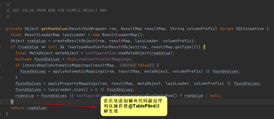

问题就在于此处代码无法应用动态代理或者切面技术，最终，我使用了javassit技术动态修改字节码对象解决了该问题。

最终，实现效果上来看，确实解决了@TableFiled注解在手写sql的情况下失效的问题，但是由于额外执行了一段代码，所以执行效率会稍微低一些；而且由于使用了javassit，代码的可读性和可维护性较低，尤其是在debug代码的时候会出现灵异现象。。。综上，作为实验性的问题解决，虽然能解决问题，但是不建议使用，哈