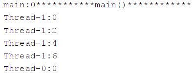
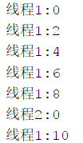
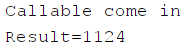
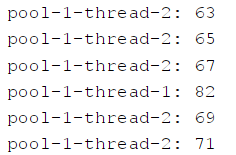

# [java创建线程（Thread）的5种方式](https://blog.csdn.net/weixin_43824267/article/details/112706385)

成就一亿技术人!2023-08-10 16:17:05本文共 7893 字阅读完需 31.5 分钟

> java创建线程（Thread）的4种方式方式一：继承于Thread类方式二：实现Runnable接口方式三：实现Callable接口方式四：使用线程池方式一：继承于Thread类步骤：1.创建一个继承于Thread类的子类2.重写Thread类的run() --> 将此线程执行的操作声明在run()中3.创建Thread类的子类的对象4.通过此对象调用start()执行线程示例代码（遍历100以内的所有的偶数）：package atguigu.java;//1.创建一个继承于_java new thread 方法

#### 方式一：继承于[Thread类](https://so.csdn.net/so/search?q=Thread类&spm=1001.2101.3001.7020)

> 步骤：
>
> 1.创建一个继承于Thread类的子类
>
> 2.重写Thread类的run() --> 将此线程执行的操作声明在run()中
>
> 3.创建Thread类的子类的对象
>
> 4.通过此对象调用start()执行线程

示例代码（遍历100以内的所有的偶数）：

```java
package atguigu.java;

//1.创建一个继承于Thread类的子类
class MyThread extends Thread {
    //2.重写Thread类的run()
    @Override
    public void run() {
        for (int i = 0; i < 100; i++) {
            if (i % 2 == 0) {
                System.out.println(Thread.currentThread().getName() + ":" + i);
            }
        }
    }
}


public class ThreadTest {
    public static void main(String[] args) {
        //3.创建Thread类的子类的对象
        MyThread t1 = new MyThread();

        //4.通过此对象调用start():①启动当前线程 ② 调用当前线程的run()
        t1.start();

        /*问题一：我们不能通过直接调用run()的方式启动线程，
        这种方式只是简单调用方法，并未新开线程*/
        //t1.run();

        /*问题二：再启动一个线程，遍历100以内的偶数。
        不可以还让已经start()的线程去执行。会报IllegalThreadStateException*/
        //t1.start();

        //重新创建一个线程的对象
        MyThread t2 = new MyThread();
        t2.start();

        //如下操作仍然是在main线程中执行的。
        for (int i = 0; i < 100; i++) {
            if (i % 2 == 0) {
                System.out.println(Thread.currentThread().getName() + ":" + i + "***********main()************");
            }
        }
    }
}
```

输出结果（部分）：


#### 方式二：实现Runnable接口

> 步骤：
>
> 1.创建一个实现了Runnable接口的类
>
> 2.实现类去实现Runnable中的抽象方法：run()
>
> 3.创建实现类的对象
>
> 4.将此对象作为参数传递到Thread类的构造器中，创建Thread类的对象
>
> 5.通过Thread类的对象调用start()
>
> ① 启动线程
>
> ②调用当前线程的run()–>调用了Runnable类型的target的run()

示例代码（遍历100以内的所有的偶数）：

```java
package atguigu.java;

//1.创建一个实现了Runnable接口的类
class MThread implements Runnable {

    //2.实现类去实现Runnable中的抽象方法：run()
    @Override
    public void run() {
        for (int i = 0; i < 100; i++) {
            if (i % 2 == 0) {
                System.out.println(Thread.currentThread().getName() + ":" + i);
            }
        }
    }
}

public class ThreadTest1 {

    public static void main(String[] args) {
        //3.创建实现类的对象
        MThread mThread = new MThread();

        //4.将此对象作为参数传递到Thread类的构造器中，创建Thread类的对象
        Thread t1 = new Thread(mThread);
        t1.setName("线程1");

        //5.通过Thread类的对象调用start():① 启动线程 ②调用当前线程的run()-->调用了Runnable类型的target的run()
        t1.start();

        //再启动一个线程，遍历100以内的偶数
        Thread t2 = new Thread(mThread);
        t2.setName("线程2");
        t2.start();
    }

}
```

输出结果（部分）：


> 方式一和方式二的比较：
>
> - 开发中优先选择实现Runnable接口的方式
> - 原因：
>   （1）实现的方式没有类的单继承性的局限性
>   （2）实现的方式更适合来处理多个线程有共享数据的情况
> - 相同点：两种方式都需要重写run(),将线程要执行的逻辑声明在run()中

#### 方式三：实现Callable接口

> 步骤：
>
> 1.创建一个实现Callable的实现类
>
> 2.实现call方法，将此线程需要执行的操作声明在call()中
>
> 3.创建Callable接口实现类的对象
>
> 4.将此Callable接口实现类的对象作为传递到FutureTask构造器中，创建FutureTask的对象
>
> 5.将FutureTask的对象作为参数传递到Thread类的构造器中，创建Thread对象，并调用start()
>
> 6.获取Callable中call方法的返回值

> 实现Callable接口的方式创建线程的强大之处
>
> - call()可以有返回值的
> - call()可以抛出异常，被外面的操作捕获，获取异常的信息
> - Callable是支持泛型的

示例代码1：

```java
package com.atguigu.java2;

import java.util.concurrent.Callable;
import java.util.concurrent.ExecutionException;
import java.util.concurrent.FutureTask;

//1.创建一个实现Callable的实现类
class NumThread implements Callable {
    //2.实现call方法，将此线程需要执行的操作声明在call()中
    @Override
    public Object call() throws Exception {
        int sum = 0;
        //把100以内的偶数相加
        for (int i = 1; i <= 100; i++) {
            if (i % 2 == 0) {
                System.out.println(i);
                sum += i;
            }
        }
        return sum;
    }
}

public class ThreadNew {
    public static void main(String[] args) {    
        //3.创建Callable接口实现类的对象
        NumThread numThread = new NumThread();

        //4.将此Callable接口实现类的对象作为传递到FutureTask构造器中，创建FutureTask的对象
        FutureTask futureTask = new FutureTask(numThread);

        //5.将FutureTask的对象作为参数传递到Thread类的构造器中，创建Thread对象，并调用start()
        new Thread(futureTask).start();

        try {
            //6.获取Callable中call方法的返回值
            //get()返回值即为FutureTask构造器参数Callable实现类重写的call()的返回值。
            Object sum = futureTask.get();
            System.out.println("总和为：" + sum);
        } catch (InterruptedException e) {
            e.printStackTrace();
        } catch (ExecutionException e) {
            e.printStackTrace();
        }
    }

}
```

输出结果（尾部）：


示例代码2：

```java
package com.jian8.juc.thread;

import java.util.concurrent.Callable;
import java.util.concurrent.ExecutionException;
import java.util.concurrent.FutureTask;
import java.util.concurrent.TimeUnit;

class MyThread implements Callable<Integer> {
    @Override
    public Integer call() throws Exception {
        System.out.println("Callable come in");
        try {
            TimeUnit.SECONDS.sleep(3);
        } catch (InterruptedException e) {
            e.printStackTrace();
        }
        return 1024;
    }
}

public class CallableDemo {
    public static void main(String[] args) throws ExecutionException, InterruptedException {

        //使用构造方法：FutureTask(Callable<V> callable)
        FutureTask<Integer> futureTask = new FutureTask<Integer>(new MyThread());

        new Thread(futureTask, "AAA").start();
        //new Thread(futureTask, "BBB").start();//复用，直接取值，不要重启两个线程
        //PS：多个线程来抢一个futureTask，里面的计算方法call()只计算一次，要想多次算，要创建多个FutureTask<V>对象

        int a = 100;
        int b = 0;

        //b = futureTask.get();//要求获得Callable线程的计算结果，如果没有计算完成就要去强求，会导致堵塞，直到计算完成
        while (!futureTask.isDone()) {//当futureTask完成后取值
            b = futureTask.get();
        }
        System.out.println("Result=" + (a + b));
    }
}
```

运行结果：


#### 方式四：使用[线程池](https://so.csdn.net/so/search?q=线程池&spm=1001.2101.3001.7020)

> 线程池好处：
>
> 1.提高响应速度（减少了创建新线程的时间）
>
> 2.降低资源消耗（重复利用线程池中线程，不需要每次都创建）
>
> 3.便于线程管理

> 核心参数：
>
> - corePoolSize：核心池的大小
> - maximumPoolSize：最大线程数
> - keepAliveTime：线程没有任务时最多保持多长时间后会终止

> 步骤：
>
> 1.以方式二或方式三创建好实现了Runnable接口的类或实现Callable的实现类
>
> 2.实现run或call方法
>
> 3.创建线程池
>
> 4.调用线程池的execute方法执行某个线程，参数是之前实现Runnable或Callable接口的对象

示例代码：

```java
package com.atguigu.java2;

import java.util.concurrent.ExecutorService;
import java.util.concurrent.Executors;
import java.util.concurrent.ThreadPoolExecutor;

class NumberThread implements Runnable {
    @Override
    public void run() {
        //遍历100以内的偶数
        for (int i = 0; i <= 100; i++) {
            if (i % 2 == 0) {
                System.out.println(Thread.currentThread().getName() + ": " + i);
            }
        }
    }
}

class NumberThread1 implements Runnable {
    @Override
    public void run() {
        //遍历100以内的奇数
        for (int i = 0; i <= 100; i++) {
            if (i % 2 != 0) {
                System.out.println(Thread.currentThread().getName() + ": " + i);
            }
        }
    }
}


public class ThreadPool {

    public static void main(String[] args) {
        //1. 提供指定线程数量的线程池
        ExecutorService service = Executors.newFixedThreadPool(10);

        //输出class java.util.concurrent.ThreadPoolExecutor
        System.out.println(service.getClass());

        ThreadPoolExecutor service1 = (ThreadPoolExecutor) service;
        //自定义线程池的属性
//        service1.setCorePoolSize(15);
//        service1.setKeepAliveTime();

        //2. 执行指定的线程的操作。需要提供实现Runnable接口或Callable接口实现类的对象
        service.execute(new NumberThread());//适用于Runnable
        service.execute(new NumberThread1());//适用于Runnable
//        service.submit(Callable callable);//适合使用于Callable

        //3. 关闭连接池
        service.shutdown();
    }

}
```

输出结果（部分）：


#### 方式五：使用匿名类

```csharp
Thread thread = new Thread(new Runnable() {
	@Override
	public void run() {
		// 线程需要执行的任务代码
		System.out.println("子线程开始启动....");
		for (int i = 0; i < 30; i++) {
			System.out.println("run i:" + i);
		}
	}
});
thread.start();
```

或者

```livescript
new Thread(() -> {
	System.out.println(Thread.currentThread().getName() + "\t上完自习，离开教室");
}, "MyThread").start();
```