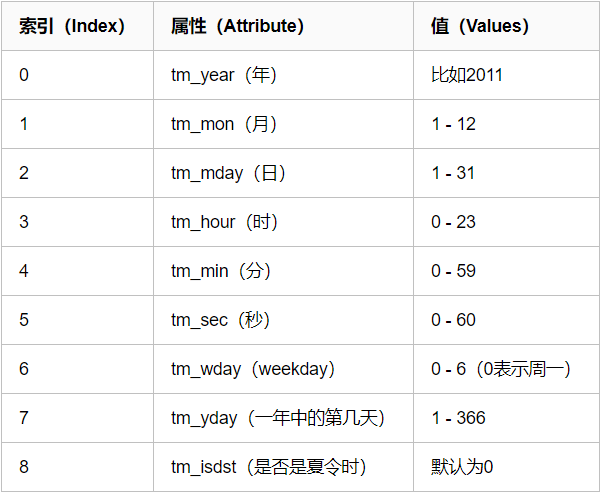

# 自定义模块

我们今天来学习一下自定义模块(也就是私人订制),我们要自定义模块,首先就要知道什么是模块啊

一个函数封装一个功能，比如现在有一个软件，不可能将所有程序都写入一个文件，所以咱们应该分文件，组织结构要好，代码不冗余，所以要分文件，但是分文件，分了5个文件，每个文件里面可能都有相同的功能（函数），怎么办？所以将这些相同的功能封装到一个文件中.

模块就是文件，存放一堆函数，谁用谁拿。怎么拿？

比如：我要策马奔腾共享人世繁华，应该怎么样？我应该骑马，你也要去浪，你是不是也要骑马。

模块是一系列常用功能的集合体，一个py文件就是一个模块

为什么要使用模块?

1、从文件级别组织程序，更方便管理
随着程序的发展，功能越来越多，为了方便管理，我们通常将程序分成一个个的文件，这样做程序的结构更清晰，方便管理。这时我们不仅仅可以把这些文件当做脚本去执行，还可以把他们当做模块来导入到其他的模块中，实现了功能的重复利用

2、拿来主义，提升开发效率
同样的原理，我们也可以下载别人写好的模块然后导入到自己的项目中使用，这种拿来主义，可以极大地提升我们的开发效率，避免重复造轮子。

```nsis
print('from the tbjx.py')
name = '太白金星'
def read1():
    print('tbjx模块：',name)
def read2():
    print('tbjx模块')
    read1()
def change():
    global name
    name = 'barry'
```

### import

import 翻译过来是一个导入的意思

```clean
模块可以包含可执行的语句和函数的定义，这些语句的目的是初始化模块，它们只在模块名第一次遇到导入import语句时才执行（import语句是可以在程序中的任意位置使用的,且针对同一个模块很import多次,为了防止你重复导入，python的优化手段是：第一次导入后就将模块名加载到内存了，后续的import语句仅是对已经加载到内存中的模块对象增加了一次引用，不会重新执行模块内的语句），如下 
import spam #只在第一次导入时才执行spam.py内代码,此处的显式效果是只打印一次'from the spam.py',当然其他的顶级代码也都被执行了,只不过没有显示效果.
```

代码示例：

```elm
import tbjx
import tbjx
import tbjx
import tbjx
import tbjx
执行结果：只是打印一次：
from the tbjx.py
```

### 第一次导入模块执行事件

1.为源文件(tbjx模块)创建新的名称空间，在tbjx中定义的函数和方法若是使用到了global时访问的就是这个名称空间。

2.创建名字tbjx来引用该命名空间

这个名字和变量名没什么区别，都是‘第一类的’，且使用tbjx.名字的方式

可以访问tbjx.py文件中定义的名字，tbjx.名字与test.py中的名字来自

两个完全不同的地方。

ps：**重复导入会直接引用内存中已经加载好的结果**

### 被导入模块有独立的名称空间

每个模块都是一个独立的名称空间，定义在这个模块中的函数，把这个模块的名称空间当做全局名称空间，这样我们在编写自己的模块时，就不用担心我们定义在自己模块中全局变量会在被导入时，与使用者的全局变量冲突

示例：

当前是meet.py

```asciidoc
import tbjx.py
name = 'alex'
print(name)
print(tbjx.name)
'''
from the tbjx.py
alex
太白金星
'''
def read1():
    print(666)
tbjx.read1()
'''
from the tbjx.py
tbjx模块： 太白金星
'''
name = '日天'
tbjx.change()
print(name)
print(tbjx.name)
'''
from the tbjx.py
日天
barry
'''
```

### 为模块起别名

别名其实就是一个绰号,好处可以将很长的模块名改成很短,方便使用.

```elm
import tbjx.py as t
t.read1()
```

有利于代码的扩展和优化

```python
#mysql.py
def sqlparse():
    print('from mysql sqlparse')
#oracle.py
def sqlparse():
    print('from oracle sqlparse')
#test.py
db_type=input('>>: ')
if db_type == 'mysql':
    import mysql as db
elif db_type == 'oracle':
    import oracle as db
db.sqlparse()
```

### 导入多个模块

```elm
import os,sys,json   这样写可以但是不推荐
推荐写法
import os
import sys
import json
```

多行导入 易于阅读 易于编辑 易于搜索 易于维护

### 1.6 from … import …

from…import…使用

```asciidoc
from tbjx import name, read1
print(name)
read1()
'''
执行结果：
from the tbjx.py
太白金星
tbjx模块： 太白金星
'''
```

### from…import… 与import对比

唯一的区别就是：使用from…import…则是将spam中的名字直接导入到当前的名称空间中，所以在当前名称空间中，直接使用名字就可以了、无需加前缀：tbjx.

from…import…的方式有好处也有坏处

好处：使用起来方便了

坏处：容易与当前执行文件中的名字冲突

示例演示：

执行文件有与模块同名的变量或者函数名，会有覆盖效果。

```asciidoc
name = 'oldboy'
from tbjx import name, read1, read2
print(name)  
'''
执行结果：
太白金星
'''
----------------------------------------
from tbjx import name, read1, read2
name = 'oldboy'
print(name)  
'''
执行结果：
oldboy
'''
----------------------------------------
def read1():
    print(666)
from tbjx import name, read1, read2
read1()
'''
执行结果：
tbjx模块： 太白金星
'''
----------------------------------------
from tbjx import name, read1, read2
def read1():
    print(666)
read1()
'''
执行结果：
tbjx模块： 666
'''
```

当前位置直接使用read1和read2就好了 执行时，仍然以spam.py文件全局名称空间

```asciidoc
#测试一：导入的函数read1，执行时仍然回到tbjx.py中寻找全局变量money
#test.py
from tbjx import read1
name = 'alex'
read1()
'''
执行结果:
from the spam.py
spam->read1->name = '太白金星'
'''
#测试二:导入的函数read2，执行时需要调用read1(),仍然回到tbjx.py中找read1()
#test.py
from tbjx import read2
def read1():
    print('==========')
read2()
'''
执行结果:
from the tbjx.py
tbjx->read2 calling read
tbjx->read1->tbjx 'barry'
'''
```

### 也支持as

```pgsql
from tbjx import read1 as read
read()
```

### 一行导入多个

```pgsql
from tbjx import read1,read2,name
```

### from … import *

```clean
#from spam import * 把spam中所有的不是以下划线(_)开头的名字都导入到当前位置
#大部分情况下我们的python程序不应该使用这种导入方式，因为*你不知道你导入什么名字，很有可能会覆盖掉你之前已经定义的名字。而且可读性极其的差，在交互式环境中导入时没有问题。
```

可以使用**all**来控制*（用来发布新版本），在tbjx.py中新增一行

```clean
__all__=['money','read1'] #这样在另外一个文件中用from spam import *就这能导入列表中规定的两个名字
```

## 模块的搜索路径

**模块的查找顺序是：内存中已经加载的模块->内置模块->sys.path路径中包含的模块**

```python
#模块的查找顺序
1、在第一次导入某个模块时（比如spam），会先检查该模块是否已经被加载到内存中（当前执行文件的名称空间对应的内存），如果有则直接引用
    ps：python解释器在启动时会自动加载一些模块到内存中，可以使用sys.modules查看
2、如果没有，解释器则会查找同名的内置模块
3、如果还没有找到就从sys.path给出的目录列表中依次寻找spam.py文件。
#需要特别注意的是：我们自定义的模块名不应该与系统内置模块重名。虽然每次都说，但是仍然会有人不停的犯错。 
#在初始化后，python程序可以修改sys.path,路径放到前面的优先于标准库被加载。
>>> import sys
>>> sys.path.append('/a/b/c/d')
>>> sys.path.insert(0,'/x/y/z') #排在前的目录，优先被搜索
注意：搜索时按照sys.path中从左到右的顺序查找，位于前的优先被查找，sys.path中还可能包含.zip归档文件和.egg文件，python会把.zip归档文件当成一个目录去处理，
#首先制作归档文件：zip module.zip foo.py bar.py 
import sys   
sys.path.append('module.zip')
# sys.path获取到的是一个列表.所以我们可以执行列表的操作
import foo
import bar
#也可以使用zip中目录结构的具体位置
sys.path.append('module.zip/lib/python')
#windows下的路径不加r开头，会语法错误
sys.path.insert(0,r'C:\Users\Administrator\PycharmProjects\a')
```

## time模块

time翻译过来就是时间,有我们其实在之前编程的时候有用到过.

```livecodeserver
#常用方法
1.time.sleep(secs)
(线程)推迟指定的时间运行。单位为秒。
2.time.time()
获取当前时间戳
```

在计算中时间共有三种方式:

1.时间戳: 通常来说，时间戳表示的是从1970年1月1日00:00:00开始按秒计算的偏移量。我们运行“type(time.time())”，返回的是float类型

2.格式化字符串时间: 格式化的时间字符串(Format String)： ‘1999-12-06’

```haml
python中时间日期格式化符号：
%y 两位数的年份表示（00-99）
%Y 四位数的年份表示（000-9999）
%m 月份（01-12）
%d 月内中的一天（0-31）
%H 24小时制小时数（0-23）
%I 12小时制小时数（01-12）
%M 分钟数（00=59）
%S 秒（00-59）
%a 本地简化星期名称
%A 本地完整星期名称
%b 本地简化的月份名称
%B 本地完整的月份名称
%c 本地相应的日期表示和时间表示
%j 年内的一天（001-366）
%p 本地A.M.或P.M.的等价符
%U 一年中的星期数（00-53）星期天为星期的开始
%w 星期（0-6），星期天为星期的开始
%W 一年中的星期数（00-53）星期一为星期的开始
%x 本地相应的日期表示
%X 本地相应的时间表示
%Z 当前时区的名称
%% %号本身
```

3.结构化时间:元组(struct_time) struct_time元组共有9个元素共九个元素:(年，月，日，时，分，秒，一年中第几周，一年中第几天等）


首先，我们先导入time模块，来认识一下python中表示时间的几种格式：

```routeros
#导入时间模块
>>>import time
#时间戳
>>>time.time()
1500875844.800804
#时间字符串
>>>time.strftime("%Y-%m-%d %X")
'2017-07-24 13:54:37'
>>>time.strftime("%Y-%m-%d %H-%M-%S")
'2017-07-24 13-55-04'
#时间元组:localtime将一个时间戳转换为当前时区的struct_time
time.localtime()
time.struct_time(tm_year=2017, tm_mon=7, tm_mday=24,
　　　　　　　　　　tm_hour=13, tm_min=59, tm_sec=37, 
                 tm_wday=0, tm_yday=205, tm_isdst=0)
```

小结：时间戳是计算机能够识别的时间；时间字符串是人能够看懂的时间；元组则是用来操作时间的

**时间格式转换：**


```routeros
#时间戳-->结构化时间
#time.gmtime(时间戳)    #UTC时间，与英国伦敦当地时间一致
#time.localtime(时间戳) #当地时间。例如我们现在在北京执行这个方法：与UTC时间相差8小时，UTC时间+8小时 = 北京时间 
>>>time.gmtime(1500000000)
time.struct_time(tm_year=2017, tm_mon=7, tm_mday=14, tm_hour=2, tm_min=40, tm_sec=0, tm_wday=4, tm_yday=195, tm_isdst=0)
>>>time.localtime(1500000000)
time.struct_time(tm_year=2017, tm_mon=7, tm_mday=14, tm_hour=10, tm_min=40, tm_sec=0, tm_wday=4, tm_yday=195, tm_isdst=0)
#结构化时间-->时间戳　
#time.mktime(结构化时间)
>>>time_tuple = time.localtime(1500000000)
>>>time.mktime(time_tuple)
1500000000.0
#结构化时间-->字符串时间
#time.strftime("格式定义","结构化时间")  结构化时间参数若不传，则显示当前时间
>>>time.strftime("%Y-%m-%d %X")
'2017-07-24 14:55:36'
>>>time.strftime("%Y-%m-%d",time.localtime(1500000000))
'2017-07-14'
#字符串时间-->结构化时间
#time.strptime(时间字符串,字符串对应格式)
>>>time.strptime("2017-03-16","%Y-%m-%d")
time.struct_time(tm_year=2017, tm_mon=3, tm_mday=16, tm_hour=0, tm_min=0, tm_sec=0, tm_wday=3, tm_yday=75, tm_isdst=-1)
>>>time.strptime("07/24/2017","%m/%d/%Y")
time.struct_time(tm_year=2017, tm_mon=7, tm_mday=24, tm_hour=0, tm_min=0, tm_sec=0, tm_wday=0, tm_yday=205, tm_isdst=-1)
```


```sas
#结构化时间 --> %a %b %d %H:%M:%S %Y串
#time.asctime(结构化时间) 如果不传参数，直接返回当前时间的格式化串
>>>time.asctime(time.localtime(1500000000))
'Fri Jul 14 10:40:00 2017'
>>>time.asctime()
'Mon Jul 24 15:18:33 2017'
#时间戳 --> %a %b %d %H:%M:%S %Y串
#time.ctime(时间戳)  如果不传参数，直接返回当前时间的格式化串
>>>time.ctime()
'Mon Jul 24 15:19:07 2017'
>>>time.ctime(1500000000)
'Fri Jul 14 10:40:00 2017'
```

计算时间差:

```cos
import time
true_time=time.mktime(time.strptime('2017-09-11 08:30:00','%Y-%m-%d %H:%M:%S'))
time_now=time.mktime(time.strptime('2017-09-12 11:00:00','%Y-%m-%d %H:%M:%S'))
dif_time=time_now-true_time
struct_time=time.gmtime(dif_time)
print('过去了%d年%d月%d天%d小时%d分钟%d秒'%(struct_time.tm_year-1970,struct_time.tm_mon-1,
                                       struct_time.tm_mday-1,struct_time.tm_hour,
                                       struct_time.tm_min,struct_time.tm_sec))
```

我们看完了time在来看一个Python处理日期和时间的标准库

## datetime

### 获取当前日期和时间

```asciidoc
from datetime import datetime
print(datetime.now())
'''
结果:2018-12-04 21:07:48.734886
'''
```

注意:`datetime`是模块，`datetime`模块还包含一个`datetime的`类，通过`from datetime import datetime`导入的才是`datetime`这个类。

如果仅导入`import datetime`，则必须引用全名`datetime.datetime`。

`datetime.now()`返回当前日期和时间，其类型是`datetime`。

### 获取指定日期和时间

要指定某个日期和时间，我们直接用参数构造一个`datetime`：

```asciidoc
from datetime import datetime
dt = datetime(2018,5,20,13,14)
print(dt)
'''
结果:2018-05-20 13:14:00
'''
```

### datetime转换为timestamp

```asciidoc
from datetime import datetime
dt = datetime.now()
new_timestamp = dt.timestamp()
print(new_timestamp)
'''
结果:1543931750.415896
'''
```

### timestamp转换为datetime

```haxe
import time
from datetime import datetime
new_timestamp = time.time()
print(datetime.fromtimestamp(new_timestamp))
```

### str转换为datetime

很多时候，用户输入的日期和时间是字符串，要处理日期和时间，首先必须把str转换为datetime。转换方法是通过`datetime.strptime()`实现，需要一个日期和时间的格式化字符串：

```asciidoc
from datetime import datetime
t = datetime.strptime('2018-4-1 00:00','%Y-%m-%d %H:%M')
print(t)
'''
结果: 2018-04-01 00:00:00
'''
```

### datetime转换为str

如果已经有了datetime对象，要把它格式化为字符串显示给用户，就需要转换为str，转换方法是通过`strftime()`实现的，同样需要一个日期和时间的格式化字符串：

```cos
from datetime import datetime
now = datetime.now()
print(now.strftime('%a, %b %d %H:%M'))
Mon, May 05 16:28
```

### datetime加减

对日期和时间进行加减实际上就是把datetime往后或往前计算，得到新的datetime。加减可以直接用`+`和`-`运算符，不过需要导入`timedelta`这个类：

```apache
from datetime import datetime, timedelta
now = datetime.now()
now
datetime.datetime(2015, 5, 18, 16, 57, 3, 540997)
now + timedelta(hours=10)
datetime.datetime(2015, 5, 19, 2, 57, 3, 540997)
now - timedelta(days=1)
datetime.datetime(2015, 5, 17, 16, 57, 3, 540997)
now + timedelta(days=2, hours=12)
datetime.datetime(2015, 5, 21, 4, 57, 3, 540997)
```

可见，使用`timedelta`你可以很容易地算出前几天和后几天的时刻。

### 小结

`datetime`表示的时间需要时区信息才能确定一个特定的时间，否则只能视为本地时间。

如果要存储`datetime`，最佳方法是将其转换为timestamp再存储，因为timestamp的值与时区完全无关。

## 序列化

什么是序列化,回想一想我们可以将python的数据结构存储到文件中,这个很简单.但是要从文件中把列表在转换出来

并且能够实现列表的操作就是比较麻烦的,要是把字典从文件中在转换出来就是难上加难了.

序列化就可以将咱们说的这个搞定,并且还有一个很大的好处就是可以持久保存了,以前咱们定义第一个列表和字典当程序

运行完,在次运行的时候就会重新创建一份,使用了序列化后就不需要在重新创建了.我们来看看说的这么nb怎么用啊

### json

首先我们需要使用import将json导入

```elm
import json
```

我们就用它四个功能 dump load dumps loads

那就先说dump和load这一对吧

#### dump


这是将咱们写的字典存储到文件中,在文件中存储的是字符串类型

json.dump(第一个参数是要转换的数据类型,第二个参数是一个文件句柄就是要存到那个文件中)

#### load


这是将文件中的字符串转成python中的数据类型,并且还能正常使用

json.load(这里放一个文件句柄,就要用从那个文件中读取内容)

#### dumps


dumps是将python中的数据类型转成字符串

dumps(参数是要转换的数据类型)

#### loads


loads是将python的数据类型转换成字符串的内容在转换成之前的数据类型

loads(要转换成原数据类型的字符串)


需要注意的一点,咱们的字典中键和值必须用**双引号**

### pickle

首先我们需要使用import将pickle导入

```elm
import pickle
```

我们也还是就用它四个功能 dump load dumps loads

#### dumps

```stylus
import pickle
dic = {'k1':'v1','k2':'v2','k3':'v3'}
str_dic = pickle.dumps(dic)
print(str_dic)  #一串二进制内容
```

用法和json一样,只不过转换出来的结果不是字符串,而是字节

#### loads

```stylus
import pickle
dic = {'k1':'v1','k2':'v2','k3':'v3'}
str_dic = pickle.dumps(dic)
print(str_dic)  #一串二进制内容
dic2 = pickle.loads(str_dic)
print(dic2)    #字典
```

用法和json一样,就是将字节转换成python的数据类型

#### dump

```stylus
import time
struct_time  = time.localtime(1000000000)
print(struct_time)
f = open('pickle_file','wb')
pickle.dump(struct_time,f)
f.close()
```

用法和json一样,就是将对象转换成字节然后存放到文件中

#### load

```stylus
f = open('pickle_file','rb')
struct_time2 = pickle.load(f)
print(struct_time2.tm_year)
```

用法和json一样,就是将文件中的字节转换成python数据类型

到目前为止发现json和pickle除了字节和字符串的不同,也没什么啊,那我告诉你pickle能够将函数名进行序列化但是json不行

pickle不能序列化匿名函数.

这时候机智的你又要说了，既然pickle如此强大，为什么还要学json呢？

这里我们要说明一下，json是一种所有的语言都可以识别的数据结构。

如果我们将一个字典或者序列化成了一个json存在文件里，那么java代码或者js代码也可以拿来用。

但是如果我们用pickle进行序列化，其他语言就不能读懂这是什么了～

所以，如果你序列化的内容是列表或者字典，我们非常推荐你使用json模块

但如果出于某种原因你不得不序列化其他的数据类型，而未来你还会用python对这个数据进行反序列化的话，那么就可以使用pickle

## os模块

os模块是与操作系统交互的一个接口

#### 文件夹相关

```dockerfile
os.makedirs('dirname1/dirname2')    可生成多层递归目录
os.removedirs('dirname1')    若目录为空，则删除，并递归到上一级目录，如若也为空，则删除，依此类推
os.mkdir('dirname')    生成单级目录；相当于shell中mkdir dirname
os.rmdir('dirname')    删除单级空目录，若目录不为空则无法删除，报错；相当于shell中rmdir dirname
os.listdir('dirname')    列出指定目录下的所有文件和子目录，包括隐藏文件，并以列表方式打印
```

#### 文件相关

```lua
os.remove()  删除一个文件
os.**rename**("oldname","newname")  重命名文件/目录
os.**stat**('path/filename')  获取文件/目录信息
```

#### 操作系统差异相关

```xl
os.sep    输出操作系统特定的路径分隔符，win下为"\\",Linux下为"/"
os.linesep    输出当前平台使用的行终止符，win下为"\t\n",Linux下为"\n"
os.pathsep    输出用于分割文件路径的字符串 win下为;,Linux下为:
os.name    输出字符串指示当前使用平台。win->'nt'; Linux->'posix'
```

#### 执行系统命令相关

```stata
os.**system**("bash command")  运行shell命令，直接显示
os.popen("bash command).read()  运行shell命令，获取执行结果
os.environ  获取系统环境变量
```

#### path系列

和路径相关

```xquery
os.path.abspath(path) 返回path规范化的绝对路径 
os.path.split(path) 将path分割成目录和文件名二元组返回 
os.path.dirname(path) 返回path的目录。其实就是os.path.split(path)的第一个元素 
os.path.basename(path) 返回path最后的文件名。如何path以／或\结尾，那么就会返回空值，即os.path.split(path)的第二个元素。
os.path.exists(path)  如果path存在，返回True；如果path不存在，返回False
os.path.isabs(path)  如果path是绝对路径，返回True
os.path.isfile(path)  如果path是一个存在的文件，返回True。否则返回False
os.path.isdir(path)  如果path是一个存在的目录，则返回True。否则返回False
os.path.join(path1[, path2[, ...]])  将多个路径组合后返回，第一个绝对路径之前的参数将被忽略
os.path.getatime(path)  返回path所指向的文件或者目录的最后访问时间
os.path.getmtime(path)  返回path所指向的文件或者目录的最后修改时间
os.path.getsize(path)   返回文件的大小
```

#### 工作路径

```vim
os.getcwd() 获取当前工作目录，即当前python脚本工作的目录路径
os.**chdir**("dirname")  改变当前脚本工作目录；相当于shell下cd
os.curdir  返回当前目录: ('.')
os.pardir  获取当前目录的父目录字符串名：('..')
```

#### start

os.stat(‘path/filename’) 获取文件/目录信息 的结构说明

```avrasm
stat 结构:
st_mode: inode 保护模式
st_ino: inode 节点号。
st_dev: inode 驻留的设备。
st_nlink: inode 的链接数。
st_uid: 所有者的用户ID。
st_gid: 所有者的组ID。
st_size: 普通文件以字节为单位的大小；包含等待某些特殊文件的数据。
st_atime: 上次访问的时间。
st_mtime: 最后一次修改的时间。
st_ctime: 由操作系统报告的"ctime"。在某些系统上（如Unix）是最新的元数据更改的时间，在其它系统上（如Windows）是创建时间（详细信息参见平台的文档）。
```

## sys模块

sys模块是与python解释器交互的一个接口

```awk
sys.argv           命令行参数List，第一个元素是程序本身路径
sys.exit(n)        退出程序，正常退出时exit(0),错误退出sys.exit(1)
sys.version        获取Python解释程序的版本信息
sys.path           返回模块的搜索路径，初始化时使用PYTHONPATH环境变量的值
sys.platform       返回操作系统平台名称
```

## hashlib模块

ython的hashlib提供了常见的摘要算法，如MD5，SHA1等等。

什么是摘要算法呢？摘要算法又称哈希算法、散列算法。它通过一个函数，把任意长度的数据转换为一个长度固定的数据串（通常用16进制的字符串表示）。

摘要算法就是通过摘要函数f()对任意长度的数据data计算出固定长度的摘要digest，目的是为了发现原始数据是否被人篡改过。

摘要算法之所以能指出数据是否被篡改过，就是因为摘要函数是一个单向函数，计算f(data)很容易，但通过digest反推data却非常困难。而且，对原始数据做一个bit的修改，都会导致计算出的摘要完全不同。

我们以常见的摘要算法MD5为例，计算出一个字符串的MD5值：

### MD5

```q
import hashlib
md5 = hashlib.md5()
md5.update('how to use md5 in python hashlib?')
print md5.hexdigest()
# 计算结果如下：
d26a53750bc40b38b65a520292f69306
```

如果数据量很大，可以分块多次调用update()，最后计算的结果是一样的：

```q
import hashlib
md5 = hashlib.md5()
md5.update('how to use md5 in ')
md5.update('python hashlib?')
print(md5.hexdigest())
```

MD5是最常见的摘要算法，速度很快，生成结果是固定的128 bit字节，通常用一个32位的16进制字符串表示。另一种常见的摘要算法是SHA1，调用SHA1和调用MD5完全类似：

### SHA1

```stylus
import hashlib
sha1 = hashlib.sha1()
sha1.update('how to use sha1 in ')
sha1.update('python hashlib?')
print(sha1.hexdigest())
```

SHA1的结果是160 bit字节，通常用一个40位的16进制字符串表示。比SHA1更安全的算法是SHA256和SHA512，不过越安全的算法越慢，而且摘要长度更长。

摘要算法应用
任何允许用户登录的网站都会存储用户登录的用户名和口令。如何存储用户名和口令呢？方法是存到数据库表中：

```asciidoc
name    | password
--------+----------
michael | 123456
bob     | abc999
alice   | alice2008
```

如果以明文保存用户口令，如果数据库泄露，所有用户的口令就落入黑客的手里。此外，网站运维人员是可以访问数据库的，也就是能获取到所有用户的口令。正确的保存口令的方式是不存储用户的明文口令，而是存储用户口令的摘要，比如MD5：

```asciidoc
username | password
---------+---------------------------------
michael  | e10adc3949ba59abbe56e057f20f883e
bob      | 878ef96e86145580c38c87f0410ad153
alice    | 99b1c2188db85afee403b1536010c2c9
```

考虑这么个情况，很多用户喜欢用123456，888888，password这些简单的口令，于是，黑客可以事先计算出这些常用口令的MD5值，得到一个反推表：

```1c
'e10adc3949ba59abbe56e057f20f883e': '123456'
'21218cca77804d2ba1922c33e0151105': '888888'
'5f4dcc3b5aa765d61d8327deb882cf99': 'password'
```

这样，无需破解，只需要对比数据库的MD5，黑客就获得了使用常用口令的用户账号。

对于用户来讲，当然不要使用过于简单的口令。但是，我们能否在程序设计上对简单口令加强保护呢？

由于常用口令的MD5值很容易被计算出来，所以，要确保存储的用户口令不是那些已经被计算出来的常用口令的MD5，这一方法通过对原始口令加一个复杂字符串来实现，俗称“加盐”：

```pgsql
hashlib.md5("salt".encode("utf8"))
```

经过Salt处理的MD5口令，只要Salt不被黑客知道，即使用户输入简单口令，也很难通过MD5反推明文口令。

但是如果有两个用户都使用了相同的简单口令比如123456，在数据库中，将存储两条相同的MD5值，这说明这两个用户的口令是一样的。有没有办法让使用相同口令的用户存储不同的MD5呢？

如果假定用户无法修改登录名，就可以通过把登录名作为Salt的一部分来计算MD5，从而实现相同口令的用户也存储不同的MD5。

摘要算法在很多地方都有广泛的应用。要注意摘要算法不是加密算法，不能用于加密（因为无法通过摘要反推明文），只能用于防篡改，但是它的单向计算特性决定了可以在不存储明文口令的情况下验证用户口令。

## collections模块

在内置数据类型（dict、list、set、tuple）的基础上，collections模块还提供了几个额外的数据类型：Counter、deque、defaultdict、namedtuple和OrderedDict等。

1.namedtuple: 生成可以使用名字来访问元素内容的tuple

2.deque: 双端队列，可以快速的从另外一侧追加和推出对象

3.Counter: 计数器，主要用来计数

4.OrderedDict: 有序字典

5.defaultdict: 带有默认值的字典

### namedtuple

我们知道tuple可以表示不变集合，例如，一个点的二维坐标就可以表示成：

```apache
p = (1, 2)
```

但是，看到(1, 2)，很难看出这个tuple是用来表示一个坐标的。

这时，namedtuple就派上了用场：

```python-repl
>>> from collections import namedtuple
>>> Point = namedtuple('Point', ['x', 'y'])
>>> p = Point(1, 2)
>>> p.x
1
>>> p.y
2
```

类似的，如果要用坐标和半径表示一个圆，也可以用namedtuple定义：

```stylus
namedtuple('名称', [属性list]):
Circle = namedtuple('Circle', ['x', 'y', 'r'])
```

### deque

使用list存储数据时，按索引访问元素很快，但是插入和删除元素就很慢了，因为list是线性存储，数据量大的时候，插入和删除效率很低。

deque是为了高效实现插入和删除操作的双向列表，适合用于队列和栈：

```stylus
>>> from collections import deque
>>> q = deque(['a', 'b', 'c'])
>>> q.append('x')
>>> q.appendleft('y')
>>> q
deque(['y', 'a', 'b', 'c', 'x'])
```

deque除了实现list的append()和pop()外，还支持appendleft()和popleft()，这样就可以非常高效地往头部添加或删除元素。

### OrderedDict

使用dict时，Key是无序的。在对dict做迭代时，我们无法确定Key的顺序。

如果要保持Key的顺序，可以用OrderedDict：

```python
>>> from collections import OrderedDict
>>> d = dict([('a', 1), ('b', 2), ('c', 3)])
>>> d # dict的Key是无序的
{'a': 1, 'c': 3, 'b': 2}
>>> od = OrderedDict([('a', 1), ('b', 2), ('c', 3)])
>>> od # OrderedDict的Key是有序的
OrderedDict([('a', 1), ('b', 2), ('c', 3)])
```

注意，OrderedDict的Key会按照插入的顺序排列，不是Key本身排序：

```python-repl
>>> od = OrderedDict()
>>> od['z'] = 1
>>> od['y'] = 2
>>> od['x'] = 3
>>> od.keys() # 按照插入的Key的顺序返回
['z', 'y', 'x']
```

### defaultdict

有如下值集合 [11,22,33,44,55,66,77,88,99,90…]，将所有大于 66 的值保存至字典的第一个key中，将小于 66 的值保存至第二个key的值中。

即： {‘k1’: 大于66 , ‘k2’: 小于66}

```stylus
li = [11,22,33,44,55,77,88,99,90]
result = {}
for row in li:
    if row > 66:
        if 'key1' not in result:
            result['key1'] = []
        result['key1'].append(row)
    else:
        if 'key2' not in result:
            result['key2'] = []
        result['key2'].append(row)
print(result)
from collections import defaultdict
values = [11, 22, 33,44,55,66,77,88,99,90]
my_dict = defaultdict(list)
for value in  values:
    if value>66:
        my_dict['k1'].append(value)
    else:
        my_dict['k2'].append(value)
```

使用dict时，如果引用的Key不存在，就会抛出KeyError。如果希望key不存在时，返回一个默认值，就可以用defaultdict：

```python-repl
>>> from collections import defaultdict
>>> dd = defaultdict(lambda: 'N/A')
>>> dd['key1'] = 'abc'
>>> dd['key1'] # key1存在
'abc'
>>> dd['key2'] # key2不存在，返回默认值
'N/A'
```

### Counter

Counter类的目的是用来跟踪值出现的次数。它是一个无序的容器类型，以字典的键值对形式存储，其中元素作为key，其计数作为value。计数值可以是任意的Interger（包括0和负数）。Counter类和其他语言的bags或multisets很相似。

```reasonml
c = Counter('abcdeabcdabcaba')
print c
输出：Counter({'a': 5, 'b': 4, 'c': 3, 'd': 2, 'e': 1})
```

## random模块

```python-repl
>>> import random
#随机小数
>>> random.random()      # 大于0且小于1之间的小数
0.7664338663654585
>>> random.uniform(1,3) #大于1小于3的小数
1.6270147180533838
#恒富：发红包
#随机整数
>>> random.randint(1,5)  # 大于等于1且小于等于5之间的整数
>>> random.randrange(1,10,2) # 大于等于1且小于10之间的奇数
#随机选择一个返回
>>> random.choice([1,'23',[4,5]])  # #1或者23或者[4,5]
#随机选择多个返回，返回的个数为函数的第二个参数
>>> random.sample([1,'23',[4,5]],2) # #列表元素任意2个组合
[[4, 5], '23']
#打乱列表顺序
>>> item=[1,3,5,7,9]
>>> random.shuffle(item) # 打乱次序
>>> item
[5, 1, 3, 7, 9]
>>> random.shuffle(item)
>>> item
[5, 9, 7, 1, 3]
```

练习：生成随机验证码

```processing
import random
def v_code():
    code = ''
    for i in range(5):
        num=random.randint(0,9)
        alf=chr(random.randint(65,90))
        add=random.choice([num,alf])
        code="".join([code,str(add)])
    return code
print(v_code())
```

### 打印进度条

```routeros
#=========知识储备==========
#进度条的效果
[#             ]
[##            ]
[###           ]
[####          ]
#指定宽度
print('[%-15s]' %'#')
print('[%-15s]' %'##')
print('[%-15s]' %'###')
print('[%-15s]' %'####')
#打印%
print('%s%%' %(100)) #第二个%号代表取消第一个%的特殊意义
#可传参来控制宽度
print('[%%-%ds]' %50) #[%-50s]
print(('[%%-%ds]' %50) %'#')
print(('[%%-%ds]' %50) %'##')
print(('[%%-%ds]' %50) %'###')
#=========实现打印进度条函数==========
import sys
import time
def progress(percent,width=50):
    if percent >= 1:
        percent=1
    show_str = ('%%-%ds' % width) % (int(width*percent)*'|')
    print('\r%s %d%%' %(show_str, int(100*percent)), end='')
#=========应用==========
data_size=1025
recv_size=0
while recv_size < data_size:
    time.sleep(0.1) #模拟数据的传输延迟
    recv_size+=1024 #每次收1024
    percent=recv_size/data_size #接收的比例
    progress(percent,width=70) #进度条的宽度70
```

## shutil模块

高级的 文件、文件夹、压缩包 处理模块

shutil.copyfileobj(fsrc, fdst[, length])
将文件内容拷贝到另一个文件中

```basic
1 import shutil
2  
3 shutil.copyfileobj(open('old.xml','r'), open('new.xml', 'w'))
```

shutil.copyfile(src, dst)
拷贝文件

```basic
1 shutil.copyfile('f1.log', 'f2.log') #目标文件无需存在
```

shutil.copymode(src, dst)
仅拷贝权限。内容、组、用户均不变

```basic
1 shutil.copymode('f1.log', 'f2.log') #目标文件必须存在
```

shutil.copystat(src, dst)
仅拷贝状态的信息，包括：mode bits, atime, mtime, flags

```basic
1 shutil.copystat('f1.log', 'f2.log') #目标文件必须存在
```

shutil.copy(src, dst)
拷贝文件和权限

```stylus
1 import shutil
2  
3 shutil.copy('f1.log', 'f2.log')
shutil.copy2(src, dst)
```

拷贝文件和状态信息

```routeros
1 import shutil
2  
3 shutil.copy2('f1.log', 'f2.log')
shutil.ignore_patterns(*patterns)
shutil.copytree(src, dst, symlinks=False, ignore=None)
```

递归的去拷贝文件夹

```basic
1 import shutil
2  
3 shutil.copytree('folder1', 'folder2', ignore=shutil.ignore_patterns('*.pyc', 'tmp*')) #目标目录不能存在，注意对folder2目录父级目录要有可写权限，ignore的意思是排除
```

拷贝软连接

```asciidoc
import shutil
shutil.copytree('f1', 'f2', symlinks=True, ignore=shutil.ignore_patterns('*.pyc', 'tmp*'))
'''
通常的拷贝都把软连接拷贝成硬链接，即对待软连接来说，创建新的文件
'''
```

shutil.rmtree(path[, ignore_errors[, onerror]])
递归的去删除文件

```stylus
1 import shutil
2  
3 shutil.rmtree('folder1')
shutil.move(src, dst)
```

递归的去移动文件，它类似mv命令，其实就是重命名。

```lasso
1 import shutil
2  
3 shutil.move('folder1', 'folder3')
shutil.make_archive(base_name, format,...)
```

创建压缩包并返回文件路径，例如：zip、tar

```gradle
base_name： 压缩包的文件名，也可以是压缩包的路径。只是文件名时，则保存至当前目录，否则保存至指定路径，
如 data_bak                       =>保存至当前路径
如：/tmp/data_bak =>保存至/tmp/
format： 压缩包种类，“zip”, “tar”, “bztar”，“gztar”
root_dir：   要压缩的文件夹路径（默认当前目录）
owner：  用户，默认当前用户
group：  组，默认当前组
logger： 用于记录日志，通常是logging.Logger对象
#将 /data 下的文件打包放置当前程序目录
import shutil
ret = shutil.make_archive("data_bak", 'gztar', root_dir='/data')
#将 /data下的文件打包放置 /tmp/目录
import shutil
ret = shutil.make_archive("/tmp/data_bak", 'gztar', root_dir='/data')
```

### 压缩包

shutil 对压缩包的处理是调用 ZipFile 和 TarFile 两个模块来进行的，详细：
zipfile压缩解压缩

```livecodeserver
import zipfile
# 压缩
z = zipfile.ZipFile('laxi.zip', 'w')
z.write('a.log')
z.write('data.data')
z.close()
# 解压
z = zipfile.ZipFile('laxi.zip', 'r')
z.extractall(path='.')
z.close()
```

tarfile压缩解压缩

```python-repl
import tarfile
# 压缩
>>> t=tarfile.open('/tmp/egon.tar','w')
>>> t.add('/test1/a.py',arcname='a.bak')
>>> t.add('/test1/b.py',arcname='b.bak')
>>> t.close()
# 解压
>>> t=tarfile.open('/tmp/egon.tar','r')
>>> t.extractall('/egon')
>>> t.close()
```

## re

re模块大家都叫它正则,那什么又是正则呢?

正则就是用一些具有特殊含义的符号组合到一起（称为正则表达式）来描述字符或者字符串的方法。或者说：正则就是用来描述一类事物的规则。（在Python中）它内嵌在Python中，并通过 re 模块实现。正则表达式模式被编译成一系列的字节码，然后由用 C 编写的匹配引擎执行。

re.match	从头开始匹配

re.search	匹配包含

re.findall	把所有匹配到的字符放到列表中返回

re.split	以匹配到的字符当作列表的分隔符

re.sub	匹配字符并替换

re.fullmatch	全部匹配

[正则表达式]中，group（）用来提出分组截获的字符串，（）用来分组

```
import  re
a  =  "123abc456"
print  re.search( "([0-9]*)([a-z]*)([0-9]*)" ,a).group( 0 )    #123abc456,返回整体
print  re.search( "([0-9]*)([a-z]*)([0-9]*)" ,a).group( 1 )    #123
print  re.search( "([0-9]*)([a-z]*)([0-9]*)" ,a).group( 2 )    #abc
print  re.search( "([0-9]*)([a-z]*)([0-9]*)" ,a).group( 3 )    #456
```

1. 正则表达式中的三组括号把匹配结果分成三组

- group() 同group（0）就是匹配正则表达式整体结果
- group(1) 列出第一个括号匹配部分，group(2) 列出第二个括号匹配部分，group(3) 列出第三个括号匹配部分。

2. 没有匹配成功的，re.search（）返回None


### 匹配模式举例

```shell
# ----------------匹配模式--------------------
# 1,之前学过的字符串的常用操作：一对一匹配
# s1 = 'fdskahf太白金星'
# print(s1.find('太白'))  # 7
```

正则匹配：

#### W

```clean
# 单个字符匹配
import re
# \w 与 \W
# print(re.findall('\w', '太白jx 12*() _'))  # ['太', '白', 'j', 'x', '1', '2', '_']
# print(re.findall('\W', '太白jx 12*() _'))  # [' ', '*', '(', ')', ' ']
```

#### S

```clean
import re
# \s 与\S
# print(re.findall('\s','太白barry*(_ \t \n'))  # [' ', '\t', ' ', '\n']
# print(re.findall('\S','太白barry*(_ \t \n'))  # ['太', '白', 'b', 'a', 'r', 'r', 'y', '*', '(', '_']
```

#### D

```clean
import re
# \d 与 \D
# print(re.findall('\d','1234567890 alex *（_'))  # ['1', '2', '3', '4', '5', '6', '7', '8', '9', '0']
# print(re.findall('\D','1234567890 alex *（_'))  # [' ', 'a', 'l', 'e', 'x', ' ', '*', '（', '_']
```

#### ^

```clean
import re
# \A 与 ^
# print(re.findall('\Ahel','hello 太白金星 -_- 666'))  # ['hel']
# print(re.findall('^hel','hello 太白金星 -_- 666'))  # ['hel']
```

#### $

```shell
# \Z、\z 与 $ 
# print(re.findall('666\Z','hello 太白金星 *-_-* \n666'))  # ['666']
# print(re.findall('666\z','hello 太白金星 *-_-* \n666'))  # []
# print(re.findall('666$','hello 太白金星 *-_-* \n666'))  # ['666']
```

#### \n

```taggerscript
# \n 与 \t
# print(re.findall('\n','hello \n 太白金星 \t*-_-*\t \n666'))  # ['\n', '\n']
# print(re.findall('\t','hello \n 太白金星 \t*-_-*\t \n666'))  # ['\t', '\t']
```

### 重复匹配

```clean
 . ? * + {m,n} .* .*?
# . 匹配任意字符，除了换行符（re.DOTALL 这个参数可以匹配\n）。
# print(re.findall('a.b', 'ab aab a*b a2b a牛b a\nb'))  # ['aab', 'a*b', 'a2b', 'a牛b']
# print(re.findall('a.b', 'ab aab a*b a2b a牛b a\nb',re.DOTALL))  # ['aab', 'a*b', 'a2b', 'a牛b']
# ？匹配0个或者1个由左边字符定义的片段。
# print(re.findall('a?b', 'ab aab abb aaaab a牛b aba**b'))  # ['ab', 'ab', 'ab', 'b', 'ab', 'b', 'ab', 'b']
# * 匹配0个或者多个左边字符表达式。 满足贪婪匹配 @@
# print(re.findall('a*b', 'ab aab aaab abbb'))  # ['ab', 'aab', 'aaab', 'ab', 'b', 'b']
# print(re.findall('ab*', 'ab aab aaab abbbbb'))  # ['ab', 'a', 'ab', 'a', 'a', 'ab', 'abbbbb']
# + 匹配1个或者多个左边字符表达式。 满足贪婪匹配  @@
# print(re.findall('a+b', 'ab aab aaab abbb'))  # ['ab', 'aab', 'aaab', 'ab']
# {m,n}  匹配m个至n个左边字符表达式。 满足贪婪匹配  @@
# print(re.findall('a{2,4}b', 'ab aab aaab aaaaabb'))  # ['aab', 'aaab']
# .* 贪婪匹配 从头到尾.
# print(re.findall('a.*b', 'ab aab a*()b'))  # ['ab aab a*()b']
# .*? 此时的?不是对左边的字符进行0次或者1次的匹配,
# 而只是针对.*这种贪婪匹配的模式进行一种限定:告知他要遵从非贪婪匹配 推荐使用!
# print(re.findall('a.*?b', 'ab a1b a*()b, aaaaaab'))  # ['ab', 'a1b', 'a*()b']
# []: 括号中可以放任意一个字符,一个中括号代表一个字符
# - 在[]中表示范围,如果想要匹配上- 那么这个-符号不能放在中间.
# ^ 在[]中表示取反的意思.
# print(re.findall('a.b', 'a1b a3b aeb a*b arb a_b'))  # ['a1b', 'a3b', 'a4b', 'a*b', 'arb', 'a_b']
# print(re.findall('a[abc]b', 'aab abb acb adb afb a_b'))  # ['aab', 'abb', 'acb']
# print(re.findall('a[0-9]b', 'a1b a3b aeb a*b arb a_b'))  # ['a1b', 'a3b']
# print(re.findall('a[a-z]b', 'a1b a3b aeb a*b arb a_b'))  # ['aeb', 'arb']
# print(re.findall('a[a-zA-Z]b', 'aAb aWb aeb a*b arb a_b'))  # ['aAb', 'aWb', 'aeb', 'arb']
# print(re.findall('a[0-9][0-9]b', 'a11b a12b a34b a*b arb a_b'))  # ['a11b', 'a12b', 'a34b']
# print(re.findall('a[*-+]b','a-b a*b a+b a/b a6b'))  # ['a*b', 'a+b']
# - 在[]中表示范围,如果想要匹配上- 那么这个-符号不能放在中间.
# print(re.findall('a[-*+]b','a-b a*b a+b a/b a6b'))  # ['a-b', 'a*b', 'a+b']
# print(re.findall('a[^a-z]b', 'acb adb a3b a*b'))  # ['a3b', 'a*b']
```

### 分组

```clean
# () 制定一个规则,将满足规则的结果匹配出来
# print(re.findall('(.*?)_sb', 'alex_sb wusir_sb 日天_sb'))  # ['alex', ' wusir', ' 日天']
# 应用举例:
# print(re.findall('href="(.*?)"','<a href="http://www.baidu.com">点击</a>'))#['http://www.baidu.com']
```

### 或

```clean
# | 匹配 左边或者右边
# print(re.findall('alex|太白|wusir', 'alex太白wusiraleeeex太太白odlb'))  # ['alex', '太白', 'wusir', '太白']
# print(re.findall('compan(y|ies)','Too many companies have gone bankrupt, and the next one is my company'))  # ['ies', 'y']
# print(re.findall('compan(?:y|ies)','Too many companies have gone bankrupt, and the next one is my company'))  # ['companies', 'company']
# 分组() 中加入?: 表示将整体匹配出来而不只是()里面的内容。
```

### 常用方法举例

```shell
#1 findall 全部找到返回一个列表。
# print(re.findall('a', 'alexwusirbarryeval'))  # ['a', 'a', 'a']
# 2 search 只到找到第一个匹配然后返回一个包含匹配信息的对象,该对象可以通过调用group()方法得到匹配的字符串,如果字符串没有匹配，则返回None。
# print(re.search('sb|alex', 'alex sb sb barry 日天'))  # <_sre.SRE_Match object; span=(0, 4), match='alex'>
# print(re.search('alex', 'alex sb sb barry 日天').group())  # alex
# 3 match：None,同search,不过在字符串开始处进行匹配,完全可以用search+^代替match
# print(re.match('barry', 'barry alex wusir 日天'))  # <_sre.SRE_Match object; span=(0, 5), match='barry'>
# print(re.match('barry', 'barry alex wusir 日天').group()) # barry
# 4 split 分割 可按照任意分割符进行分割
# print(re.split('[ ：:,;；，]','alex wusir,日天，太白;女神;肖锋：吴超'))  # ['alex', 'wusir', '日天', '太白', '女神', '肖锋', '吴超']
# 5 sub 替换
# print(re.sub('barry', '太白', 'barry是最好的讲师，barry就是一个普通老师，请不要将barry当男神对待。'))
# 太白是最好的讲师，太白就是一个普通老师，请不要将太白当男神对待。
# print(re.sub('barry', '太白', 'barry是最好的讲师，barry就是一个普通老师，请不要将barry当男神对待。',2))
# 太白是最好的讲师，太白就是一个普通老师，请不要将barry当男神对待。
# print(re.sub('([a-zA-Z]+)([^a-zA-Z]+)([a-zA-Z]+)([^a-zA-Z]+)([a-zA-Z]+)', r'\5\2\3\4\1', r'alex is sb'))
# sb is alex
# 6 重复使用
# obj=re.compile('\d{2}')
# print(obj.search('abc123eeee').group()) #12
# print(obj.findall('abc123eeee')) #['12'],重用了obj
# import re
# ret = re.finditer('\d', 'ds3sy4784a')   #finditer返回一个存放匹配结果的迭代器
# print(ret)  # <callable_iterator object at 0x10195f940>
# print(next(ret).group())  #查看第一个结果
# print(next(ret).group())  #查看第二个结果
# print([i.group() for i in ret])  #查看剩余的左右结果
```

### 命名分组举例（了解）

```clean
# 命名分组匹配：
ret = re.search("<(?P<tag_name>\w+)>\w+</(?P=tag_name)>","<h1>hello</h1>")
# #还可以在分组中利用?<name>的形式给分组起名字
# #获取的匹配结果可以直接用group('名字')拿到对应的值
# print(ret.group('tag_name'))  #结果 ：h1
# print(ret.group())  #结果 ：<h1>hello</h1>
#
# ret = re.search(r"<(\w+)>\w+</\1>","<h1>hello</h1>")
# #如果不给组起名字，也可以用\序号来找到对应的组，表示要找的内容和前面的组内容一致
# #获取的匹配结果可以直接用group(序号)拿到对应的值
# print(ret.group(1)) #结果: hello
# print(ret.group())  #结果 ：<h1>hello</h1>
```

## logging模块

我们来说一下这个logging模块,这个模块的功能是记录我们软件的各种状态,你们现在和我一起找到红蜘蛛的那个图标,然后右键找一找是不是有个错误日志.其实每个软件都是有错误日志的,开发人员可以通过错误日志中的内容对他的程序进行修改, 我们也需要写日志

### 函数式简单配置

我们先来看一下**函数式简单配置**

```routeros
import logging  
logging.debug('debug message')  
logging.info('info message')  
logging.warning('warning message')  
logging.error('error message')  
logging.critical('critical message')
```

默认情况下Python的logging模块将日志打印到了标准输出中，且只显示了大于等于WARNING级别的日志，这说明默认的日志级别设置为WARNING（日志级别等级CRITICAL > ERROR > WARNING > INFO > DEBUG），默认的日志格式为日志级别：Logger名称：用户输出消息。

我们自己用函数写的这个可以正常使用但是不够灵活,我们看看这个灵活的

### 灵活配置

灵活配置日志级别，日志格式，输出位置

```routeros
import logging  
logging.basicConfig(level=logging.DEBUG,  
                    format='%(asctime)s %(filename)s[line:%(lineno)d] %(levelname)s %(message)s',  
                    datefmt='%a, %d %b %Y %H:%M:%S',  
                    filename='/tmp/test.log',  
                    filemode='w')  
logging.debug('debug message')  
logging.info('info message')  
logging.warning('warning message')  
logging.error('error message')  
logging.critical('critical message')
```

### 参数配置

```haml
logging.basicConfig()函数中可通过具体参数来更改logging模块默认行为，可用参数有：
filename：用指定的文件名创建FiledHandler，这样日志会被存储在指定的文件中。
filemode：文件打开方式，在指定了filename时使用这个参数，默认值为“a”还可指定为“w”。
format：指定handler使用的日志显示格式。
datefmt：指定日期时间格式。
level：设置rootlogger（后边会讲解具体概念）的日志级别
stream：用指定的stream创建StreamHandler。可以指定输出到sys.stderr,sys.stdout或者文件(f=open(‘test.log’,’w’))，默认为sys.stderr。若同时列出了filename和stream两个参数，则stream参数会被忽略。
format参数中可能用到的格式化串：
%(name)s Logger的名字
%(levelno)s 数字形式的日志级别
%(levelname)s 文本形式的日志级别
%(pathname)s 调用日志输出函数的模块的完整路径名，可能没有
%(filename)s 调用日志输出函数的模块的文件名
%(module)s 调用日志输出函数的模块名
%(funcName)s 调用日志输出函数的函数名
%(lineno)d 调用日志输出函数的语句所在的代码行
%(created)f 当前时间，用UNIX标准的表示时间的浮 点数表示
%(relativeCreated)d 输出日志信息时的，自Logger创建以 来的毫秒数
%(asctime)s 字符串形式的当前时间。默认格式是 “2003-07-08 16:49:45,896”。逗号后面的是毫秒
%(thread)d 线程ID。可能没有
%(threadName)s 线程名。可能没有
%(process)d 进程ID。可能没有
%(message)s用户输出的消息
```

### logger对象配置

```routeros
import logging
logger = logging.getLogger()
# 创建一个handler，用于写入日志文件
fh = logging.FileHandler('test.log',encoding='utf-8') 
# 再创建一个handler，用于输出到控制台 
ch = logging.StreamHandler() 
formatter = logging.Formatter('%(asctime)s - %(name)s - %(levelname)s - %(message)s')
logger.setLevel(logging.DEBUG)
fh.setFormatter(formatter) 
ch.setFormatter(formatter) 
logger.addHandler(fh) #logger对象可以添加多个fh和ch对象 
logger.addHandler(ch) 
logger.debug('logger debug message') 
logger.info('logger info message') 
logger.warning('logger warning message') 
logger.error('logger error message') 
logger.critical('logger critical message')
```

logging库提供了多个组件：Logger、Handler、Filter、Formatter。Logger对象提供应用程序可直接使用的接口

Handler发送日志到适当的目的地，

Filter提供了过滤日志信息的方法，

Formatter指定日志显示格式。另外，可以通过：logger.setLevel(logging.Debug)设置级别

日志我们一般写代码的时候会添加,部分公司和部分项目要求不一样,

info一般都是记录一些消费信息,操作信息,转账信息

info以上的级别就是在程序出现错误的时候会记录

## 包

你们听到的包,可不是女同胞疯狂喜欢的那个包,我们来看看这个是啥包
官方解释:

```arduino
Packages are a way of structuring Python’s module namespace by using “dotted module names”
包是一种通过使用‘.模块名’来组织python模块名称空间的方式。
#具体的：包就是一个包含有__init__.py文件的文件夹，所以其实我们创建包的目的就是为了用文件夹将文件/模块组织起来
#需要强调的是：
　　1. 在python3中，即使包下没有__init__.py文件，import 包仍然不会报错，而在python2中，包下一定要有该文件，否则import 包报错
　　2. 创建包的目的不是为了运行，而是被导入使用，记住，包只是模块的一种形式而已，包的本质就是一种模块
```

为什么要使用包呢?

包的本质就是一个文件夹，那么文件夹唯一的功能就是将文件组织起来

随着功能越写越多，我们无法将所以功能都放到一个文件中，于是我们使用模块去组织功能，而随着模块越来越多，我们就需要用文件夹将模块文件组织起来，以此来提高程序的结构性和可维护性

注意事项

```lasso
#1.关于包相关的导入语句也分为import和from ... import ...两种，但是无论哪种，无论在什么位置，在导入时都必须遵循一个原则：凡是在导入时带点的，点的左边都必须是一个包，否则非法。可以带有一连串的点，如item.subitem.subsubitem,但都必须遵循这个原则。但对于导入后，在使用时就没有这种限制了，点的左边可以是包,模块，函数，类(它们都可以用点的方式调用自己的属性)。
#2、import导入文件时，产生名称空间中的名字来源于文件，import 包，产生的名称空间的名字同样来源于文件，即包下的__init__.py，导入包本质就是在导入该文件
#3、包A和包B下有同名模块也不会冲突，如A.a与B.a来自俩个命名空间
```

### 包的使用

示例文件

```stylus
glance/                   #Top-level package
├── __init__.py      #Initialize the glance package
├── api                  #Subpackage for api
│   ├── __init__.py
│   ├── policy.py
│   └── versions.py
├── cmd                #Subpackage for cmd
│   ├── __init__.py
│   └── manage.py
└── db                  #Subpackage for db
    ├── __init__.py
    └── models.py
```

### 文件内容

```python
#policy.py
def get():
    print('from policy.py')
#versions.py
def create_resource(conf):
    print('from version.py: ',conf)
#manage.py
def main():
    print('from manage.py')
#models.py
def register_models(engine):
    print('from models.py: ',engine)
包所包含的文件内容
```

执行文件与示范文件在同级目录下

### 包的使用之import

```basic
1 import glance.db.models
2 glance.db.models.register_models('mysql')
```

单独导入包名称时不会导入包中所有包含的所有子模块，如

```asciidoc
#在与glance同级的test.py中
import glance
glance.cmd.manage.main()
'''
执行结果：
AttributeError: module 'glance' has no attribute 'cmd'
'''
```

解决方法：

```basic
1 #glance/__init__.py
2 from . import cmd
3 
4 #glance/cmd/__init__.py
5 from . import manage
```

执行：

```basic
1 #在于glance同级的test.py中
2 import glance
3 glance.cmd.manage.main()
```

### 包的使用之from … import …

需要注意的是from后import导入的模块，必须是明确的一个不能带点，否则会有语法错误，如：from a import b.c是错误语法

from glance.api import *

在讲模块时，我们已经讨论过了从一个模块内导入所有，此处我们研究从一个包导入所有。

此处是想从包api中导入所有，实际上该语句只会导入包api下__init**.py文件中定义的名字，我们可以在这个文件中定义_all**:

```routeros
#在__init__.py中定义
x=10
def func():
    print('from api.__init.py')
__all__=['x','func','policy']
```

此时我们在于glance同级的文件中执行from glance.api import *就导入**all**中的内容（versions仍然不能导入）。

```routeros
#在__init__.py中定义
x=10
def func():
    print('from api.__init.py')
__all__=['x','func','policy']
```

此时我们在于glance同级的文件中执行from glance.api import *就导入**all**中的内容（versions仍然不能导入）。

练习：

```pgsql
#执行文件中的使用效果如下，请处理好包的导入
from glance import *
get()
create_resource('a.conf')
main()
register_models('mysql')
#在glance.__init__.py中
from .api.policy import get
from .api.versions import create_resource
from .cmd.manage import main
from .db.models import  register_models
__all__=['get','create_resource','main','register_models']
```

### 绝对导入和相对导入

我们的最顶级包glance是写给别人用的，然后在glance包内部也会有彼此之间互相导入的需求，这时候就有绝对导入和相对导入两种方式：

绝对导入：以glance作为起始

相对导入：用.或者..的方式最为起始（只能在一个包中使用，不能用于不同目录内）

例如：我们在glance/api/version.py中想要导入glance/cmd/manage.py

```basic
1 在glance/api/version.py
2 
3 #绝对导入
4 from glance.cmd import manage
5 manage.main()
6 
7 #相对导入
8 from ..cmd import manage
9 manage.main()
```

测试结果：注意一定要在于glance同级的文件中测试

```basic
1 from glance.api import versions
```

包以及包所包含的模块都是用来被导入的，而不是被直接执行的。而环境变量都是以执行文件为准的

比如我们想在glance/api/versions.py中导入glance/api/policy.py，有的同学一抽这俩模块是在同一个目录下，十分开心的就去做了，它直接这么做

```basic
1 #在version.py中
2 
3 import policy
4 policy.get()
```

没错，我们单独运行version.py是一点问题没有的，运行version.py的路径搜索就是从当前路径开始的，于是在导入policy时能在当前目录下找到

但是你想啊，你子包中的模块version.py极有可能是被一个glance包同一级别的其他文件导入，比如我们在于glance同级下的一个test.py文件中导入version.py，如下

```python
 1 from glance.api import versions
 2 
 3 '''
 4 执行结果:
 5 ImportError: No module named 'policy'
 6 '''
 7 
 8 '''
 9 分析:
10 此时我们导入versions在versions.py中执行
11 import policy需要找从sys.path也就是从当前目录找policy.py,
12 这必然是找不到的
13 '''
```

绝对导入与相对导入总结

```haxe
绝对导入与相对导入
# 绝对导入: 以执行文件的sys.path为起始点开始导入,称之为绝对导入
#        优点: 执行文件与被导入的模块中都可以使用
#        缺点: 所有导入都是以sys.path为起始点,导入麻烦
# 相对导入: 参照当前所在文件的文件夹为起始开始查找,称之为相对导入
#        符号: .代表当前所在文件的文件加,..代表上一级文件夹,...代表上一级的上一级文件夹
#        优点: 导入更加简单
#        缺点: 只能在导入包中的模块时才能使用
　　　　  #注意:
　　　　　　　　1. 相对导入只能用于包内部模块之间的相互导入,导入者与被导入者都必须存在于一个包内
　　　　　　　　2. attempted relative import beyond top-level package # 试图在顶级包之外使用相对导入是错误的,言外之意,必须在顶级包内使用相对导入,每增加一个.代表跳到上一级文件夹,而上一级不应该超出顶级包
```